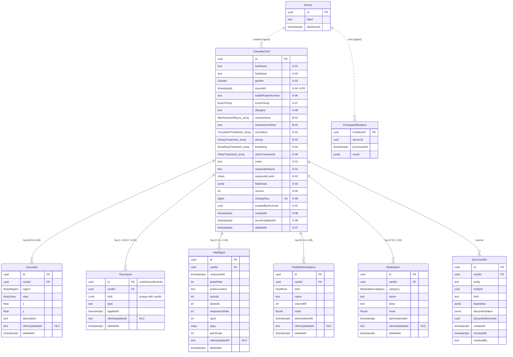
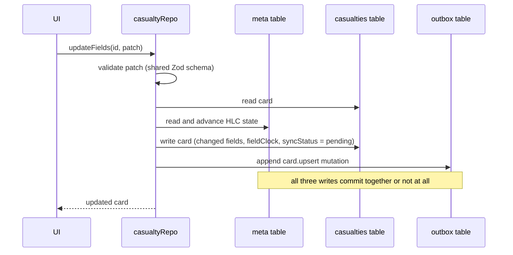

# Data Model and Local Storage

**Project:** Offline-First Progressive Web Application for Managing Medical Records in Field Conditions

**Thesis point:** 3. Data structures and local storage (DD Form 1380)

**Document status:** Draft v0.1

**Related documents:** [`PLAN.md`](../PLAN.md) (Point 3), [`docs/requirements.md`](requirements.md) (field identifiers A-01 to S-09), [`docs/technology-review.md`](technology-review.md) (decisions D-01 to D-14)

---

## 1. Overview

The data model has three tiers, which share a single vocabulary of names, enums and validation rules:

| Tier | Technology | Location | Role |
|---|---|---|---|
| Server store | PostgreSQL 15, Prisma 7.10 | `apps/server/prisma/schema.prisma`, `apps/server/prisma/migrations/` | System of record. Normalized tables with database-level integrity constraints |
| Shared contract | TypeScript, Zod 4 | `packages/shared` (`@tccc/shared`) | Enums, field schemas, synchronization protocol, Hybrid Logical Clock, identifier generation |
| Local store | IndexedDB, Dexie 4 | `apps/client/src/lib/db/` | Device replica. One document per card, plus an outbox of pending mutations |

The **casualty card is the aggregate root**. Every child record (injury site, tourniquet, vital signs set, fluid, medication) belongs to exactly one card, and the card is the unit of synchronization: a push mutation targets one card, and a pull returns whole cards.

## 2. Server schema

### 2.1 Entity-relationship diagram



`Device` is related to cards and processed mutations only logically (by identifier). There is deliberately no foreign key: a device's first push may arrive before the server has registered the device.

### 2.2 Mapping of card sections

The section letters follow the thesis plan: A, B, C, E, F, G and H. **Section D is intentionally omitted.** It is the header on the reverse side of DD Form 1380, which repeats the battle roster number and the evacuation category from the front so that the card can be identified from either side. Storing it separately would duplicate A-06 and A-07 and create two values that could disagree after a merge, so the reverse header is rendered from those fields instead.

Sections A, B (mechanism of injury), E (intervention checkboxes), G and H hold one value per card and are columns of `CasualtyCard`. Sections C and F are repeating groups: each vital-signs measurement and each medication administration is a separate child row (`VitalSigns`, `Medication`) with its own time stamp, identifier and tombstone. In `@tccc/shared`, `sectionASchema`, `sectionBSchema`, `sectionESchema`, `sectionGSchema` and `sectionHSchema` validate card fields, while `sectionCSchema` and `sectionFSchema` are aliases of `vitalSignsSchema` and `medicationSchema` and validate a single row.

### 2.3 Modelling decisions

1. **Multi-select checkbox groups are PostgreSQL enum arrays** (`mechanisms`, `circulation`, `airway`, `breathing`, `otherTreatments`). On the paper card these are sets of checkboxes, not independent records, so a join table would add writes and merge complexity without analytical benefit. The whole set is one field for conflict resolution purposes.
2. **Repeating groups are child tables** (injury sites, tourniquets, vital signs, fluids, medications). Each row has its own identifier, HLC and tombstone, so two devices adding different vital-sign sets offline never conflict.
3. **Date and time (A-04, A-05) are one `timestamptz`** (`injuredAt`), which removes time zone ambiguity. The user interface still presents two inputs.
4. **One tourniquet per limb** is enforced by the unique constraint `(cardId, limb)`, and the tourniquet identifier is derived as `uuidv5(cardId + ":" + limb)` with a fixed namespace (`packages/shared/src/ids.ts`). Two devices recording a tourniquet on the same limb offline therefore produce the *same* row identifier, and the records merge instead of violating the constraint.
5. **All clinical fields are nullable** (requirement FR-16). Only system identifiers are mandatory; an incomplete card is always preferable to no card.
6. **Soft deletion everywhere** (`deletedAt`). A deletion is a field value that is synchronized and merged like any other (FR-24).
7. **Client-generated identifiers.** Cards and child rows use UUIDv7, generated on the device, so records can be created offline and referenced before the server has seen them (FR-10). UUIDv7 is time-ordered, which keeps B-tree index inserts local.

### 2.4 Integrity constraints

Constraints that Prisma cannot express are added in the hand-written migration `20260923191728_sync_infra`. They duplicate the Zod rules, so that invalid data is rejected even if it bypasses the API.

| Constraint | Table | Rule | Field IDs |
|---|---|---|---|
| `vitals_pulse_chk` | VitalSigns | `pulseRate` 0-300 | C-02 |
| `vitals_systolic_chk` | VitalSigns | `systolic` 0-300 | C-04 |
| `vitals_diastolic_chk` | VitalSigns | `diastolic` 0-200 | C-05 |
| `vitals_resp_chk` | VitalSigns | `respiratoryRate` 0-80 | C-06 |
| `vitals_spo2_chk` | VitalSigns | `spo2` 0-100 | C-07 |
| `vitals_pain_scale_chk` | VitalSigns | `painScale` 0-10 | C-09 |
| `card_responder_last4_chk` | CasualtyCard | `responderLast4 ~ '^[0-9]{4}$'` | H-02 |
| `fluid_volume_chk` | FluidAdministration | `volumeMl` 1-10000 | E-06 |
| `injury_site_x_chk`, `injury_site_y_chk` | InjurySite | `x`, `y` within 0-1 | B-05 |
| `Tourniquet_cardId_limb_key` | Tourniquet | unique `(cardId, limb)` | B-07 |

Cross-field rules (systolic not lower than diastolic, at least one measurement per vital-signs set, `changedFields` matching the patch keys) are enforced only in the shared Zod schemas.

The "not later than the current time plus 5 minutes" rule for time fields is intentionally not enforced by the server or the database. The server's clock and the device's clock are not synchronized in the field, so such a check could reject legitimate records. It will be applied as form-level validation on the device.

### 2.5 Synchronization metadata

| Field | Purpose |
|---|---|
| `fieldClock` (S-03) | JSON map from card field name to the HLC time stamp of its last write. Used for field-level last-writer-wins merge |
| `clientUpdatedAt` (S-04) | HLC time stamp of the last write of a child row. Used for row-level last-writer-wins merge |
| `version` (S-05) | Incremented on each accepted write. Clients send the version they last saw as `baseVersion`; a match enables the fast path without merging |
| `changeSeq` (S-06) | Value from the PostgreSQL sequence `card_change_seq`, assigned on each write inside the same transaction (`src/prisma/change-seq.ts`). Used as the pull cursor: `GET /api/sync/pull?since=<changeSeq>` |
| `ProcessedMutation` | Idempotency log keyed by the client's `mutationId`. A replayed mutation returns the stored result instead of being applied twice (FR-23) |
| `SyncConflict` | Every value overwritten by a merge is preserved here for review (FR-07) |

A sequence is used for `changeSeq` instead of `serverUpdatedAt` because wall-clock time stamps can collide or go backwards, whereas a sequence value is unique and strictly increasing, so a client can never skip a change by paging with `since`.

## 3. Shared contract (`@tccc/shared`)

| Module | Contents |
|---|---|
| `enums.ts` | The 14 enums as `as const` objects. `apps/server/src/prisma/shared-enums.spec.ts` fails if they drift from the Prisma schema |
| `schemas/card.ts` | Zod schemas per DD1380 section, child row schemas, the full server aggregate `casualtyCardSchema`, `CARD_FIELDS`, `cardPatchSchema` |
| `schemas/sync.ts` | Mutation types (`card.upsert`, `card.delete`, `child.upsert`, `child.delete`), push request and response, pull query and response |
| `hlc.ts` | Hybrid Logical Clock: `tickHlc`, `receiveHlc`, `formatHlc`, `compareHlc` |
| `ids.ts` | `newId()` (UUIDv7), `tourniquetId(cardId, limb)` (UUIDv5) |

**HLC format.** `"<wall time, 13 digits>:<counter, 4 digits>:<node id>"`, for example `1790000000000:0003:0192f000-...`. Fixed-width zero padding makes plain string comparison equal to causal ordering, with the node (device) identifier as a deterministic tie-breaker. The clock never moves backwards, even if the device clock does (NFR-14).

## 4. Local store (Dexie)

### 4.1 Tables

```ts
casualties: "id, evacPriority, syncStatus, clientUpdatedAt, deletedAt, battleRosterNumber, [lastName+firstName]"
outbox:     "++seq, &mutationId, cardId, status, createdAt"
conflicts:  "id, cardId, resolvedAt"
meta:       "key"
```

| Table | Record | Notes |
|---|---|---|
| `casualties` | `LocalCasualtyCard`: all card fields, child rows embedded as arrays, `fieldClock`, `syncStatus`, `serverVersion`, `clientUpdatedAt` | One document per card, so a card is read in one operation and written atomically |
| `outbox` | `OutboxMutation`: a shared `Mutation` plus `seq`, `status`, `attempts`, `createdAt`, `lastError` | `seq` gives FIFO order. `mutationId` is unique and is the server's idempotency key |
| `conflicts` | Conflicts on clinically critical fields copied from push results | Reviewed on `/sync` (FR-27) |
| `meta` | Key-value pairs: `deviceId`, `lastPullSeq`, `hlcState`, `serverClockOffsetMs`, `responderProfile`, `persistenceRequested` | Typed through `MetaValues` in `types.ts` |

The local store embeds child rows while the server normalizes them. Embedding suits IndexedDB, which has no joins and whose transactions are cheapest when they touch few records. Normalizing suits PostgreSQL, where constraints and queries operate on rows.

### 4.2 Transactional write path

Every repository write (`casualtyRepo.ts`) runs in **one Dexie read-write transaction over `casualties`, `outbox` and `meta`**:



Consequences:

- The HLC state, the card and its outbox entry can never disagree after a crash or tab termination (NFR-02).
- Only fields whose values actually changed are stamped and queued, so a form autosave that re-submits unchanged values produces no network traffic.
- A deleted child row is kept as a tombstone with a new HLC, so the deletion competes with concurrent edits by time stamp on the server.
- An edit to a soft-deleted card is refused (`CardNotFoundError`).

### 4.3 Migration policy

Each schema change is a new `this.version(n).stores(...).upgrade(...)` block. Existing version blocks are never modified, because installed clients have already run them.

### 4.4 Storage durability

By default, browsers treat IndexedDB as "best-effort" storage and may evict it under storage pressure, which would destroy unsynchronized casualty records. On the first launch, the client calls `navigator.storage.persist()` (`ensurePersistentStorage()` in `persistence.ts`, mounted from the root layout by `StorageBootstrap`) and records `persistenceRequested = true` in `meta`. The request is not repeated automatically, because Firefox shows a permission prompt on every call. The `/settings` page reports whether persistence was granted, together with the usage and quota returned by `navigator.storage.estimate()` (FR-44).

### 4.5 Encryption at rest (deferred)

Encrypting the personal fields A-01, A-02, A-06 and A-08 with AES-GCM and a PIN-derived key (NFR-10) is deferred. It is optional in the plan, and it affects every read path, search and the sync payload, so it is best introduced after the user interface and the sync engine are stable.

## 5. Verification

| Check | Result |
|---|---|
| Migrations `init` and `sync_infra` apply to an empty database | Passed (`prisma migrate status`: up to date) |
| Seed creates 20 cards with child rows (`prisma db seed`) | Passed: 20 cards, 41 injury sites, 11 tourniquets, 45 vital-sign sets, 34 medications |
| Seeded aggregates validate against `casualtyCardSchema` | Passed (checked by the seed script itself through `toCardDto`) |
| Database rejects `painScale = 15`, `responderLast4 = '12a4'`, a second tourniquet on the same limb | Passed (IT-API-03, manual run) |
| Shared package unit tests (HLC, identifiers, schemas) | 33 passed |
| Server unit tests (enum drift check) | 16 passed |
| Client repository tests with `fake-indexeddb` (UT-DB-01) | 10 passed, including "a failed write stores neither the card nor the outbox entry" |
| Client persistence tests (one request per installation, `meta` flag, graceful degradation without the Storage API) | 5 passed |

## 6. Revision history

| Version | Date | Author | Description |
|---|---|---|---|
| 0.1 | 2026-09-23 | Vladyslav | Initial version after completion of Point 3 |
| 0.2 | 2026-09-24 | Vladyslav | Section mapping (omission of Section D, C and F as child rows), storage durability, deferred encryption |
