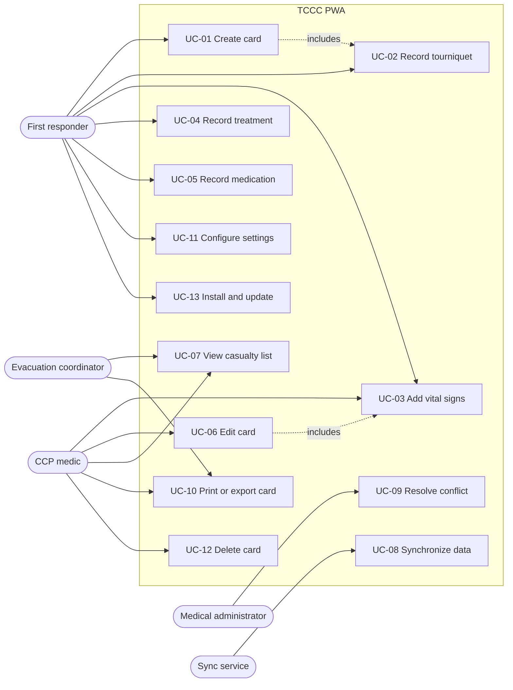

# Requirements Specification

**Project:** Offline-First Progressive Web Application for Managing Medical Records in Field Conditions

**Domain standard:** Tactical Combat Casualty Care (TCCC) Card, DD Form 1380

**Thesis point:** 1. Domain analysis and requirements specification

**Document status:** Draft v0.1

**Related documents:** [`PLAN.md`](../PLAN.md) (engineering roadmap), `docs/technology-review.md` (Point 2), `docs/data-model.md` (Point 3), `docs/sync-design.md` (Point 4), `docs/implementation.md` (Point 5), `docs/test-report.md` (Point 6)

---

## Table of contents

1. [Introduction](#1-introduction)
2. [Domain analysis](#2-domain-analysis)
3. [Stakeholders and actors](#3-stakeholders-and-actors)
4. [Operating environment and constraints](#4-operating-environment-and-constraints)
5. [DD Form 1380 field inventory](#5-dd-form-1380-field-inventory)
6. [Use cases](#6-use-cases)
7. [Functional requirements](#7-functional-requirements)
8. [Non-functional requirements](#8-non-functional-requirements)
9. [Prioritization (MoSCoW)](#9-prioritization-moscow)
10. [Verification approach and test identifiers](#10-verification-approach-and-test-identifiers)
11. [Traceability matrix](#11-traceability-matrix)
12. [Assumptions, dependencies and risks](#12-assumptions-dependencies-and-risks)
13. [Glossary](#13-glossary)
14. [Revision history](#14-revision-history)

---

## 1. Introduction

### 1.1 Purpose

This document specifies the requirements for an offline-first Progressive Web Application (PWA) that digitizes the TCCC Casualty Card (DD Form 1380). It defines what the system shall do (functional requirements), the qualities it shall exhibit (non-functional requirements), and the data it shall capture (field inventory). It also establishes a traceability framework linking each requirement to its implementing module and its verification procedure.

The document has two roles. It is the source material for the first chapter of the thesis, and it is a working reference for tracking implementation progress. For the second role, every requirement, use case and field carries a status attribute that is updated as development proceeds (see Section 1.5).

### 1.2 Scope

The system enables first responders to create, view, edit and synchronize casualty records at the point of injury and during subsequent phases of care, under conditions where network connectivity is absent, intermittent or degraded. The scope comprises:

- A client application (Next.js, Serwist service worker, Dexie.js/IndexedDB) that operates fully without network access.
- A server application (NestJS, Prisma ORM, PostgreSQL) that acts as the durable system of record and coordinates synchronization between devices.
- A synchronization protocol that reconciles changes made concurrently on multiple devices.

The following are **outside the scope** of this work:

- Integration with national or military electronic health record systems.
- Clinical decision support (for example, automated triage or dosage calculation).
- Real-time location tracking of casualties or responders.
- Native mobile applications. The system is delivered exclusively as a PWA.
- Card elements of DD Form 1380 other than the sections enumerated in Section 5.

### 1.3 Intended audience

- The thesis author and academic advisor.
- Developers implementing and maintaining the system.
- Evaluators assessing the testing results in Point 6.

### 1.4 Definitions of requirement keywords

The keywords **shall**, **should** and **may** are used as follows:

- **Shall:** a mandatory requirement. The system is not considered complete without it.
- **Should:** a strongly recommended requirement. Omission must be justified.
- **May:** an optional requirement, implemented if time permits.

### 1.5 Progress tracking conventions

Each tracked item carries one of the following status values:

| Status | Meaning |
|---|---|
| `Not started` | No implementation work has begun |
| `In progress` | Implementation has begun but is incomplete or unverified |
| `Implemented` | Implementation is complete. Verification is pending |
| `Verified` | The associated test cases pass |
| `Deferred` | Consciously postponed (with justification in the notes) |

As of revision 0.2 (completion of `PLAN.md` Point 3), the data layer is in place on all three tiers: the PostgreSQL schema with CHECK constraints, the shared Zod schemas, and the Dexie local store with its transactional repository. Consequently, every DD1380 field in Section 5 is `In progress`: it is stored, validated and synchronizable, but it has no user interface yet (Point 5). Requirements that depend only on the data layer are `Implemented`. All other items are `Not started` unless stated otherwise.

---

## 2. Domain analysis

### 2.1 Tactical Combat Casualty Care

Tactical Combat Casualty Care (TCCC) is a set of evidence-based guidelines for the prehospital care of casualties in a tactical environment. It divides care into three phases:

| Phase | Characteristics | Documentation implications |
|---|---|---|
| **Care Under Fire (CUF)** | The responder and casualty are under effective hostile fire. Care is limited to control of massive external hemorrhage, typically by tourniquet | Documentation is minimal or deferred. The only data likely recorded is the tourniquet application time |
| **Tactical Field Care (TFC)** | The immediate threat has been suppressed, but resources are limited and the situation may change rapidly | The casualty card is initiated. Assessment follows the MARCH sequence, vital signs are recorded, and treatments and medications are documented |
| **Tactical Evacuation Care (TACEVAC)** | The casualty is being transported to a higher level of care | The card accompanies the casualty. Serial vital signs and additional treatments are appended by evacuation personnel |

The MARCH algorithm (Massive hemorrhage, Airway, Respiration, Circulation, Hypothermia and head injury) determines the order of assessment and treatment during Tactical Field Care. The layout of the treatment sections on DD Form 1380 reflects this sequence, and the user interface of the system shall follow the same order.

### 2.2 The TCCC Casualty Card (DD Form 1380)

DD Form 1380 is a standardized card that documents the injuries and prehospital care of a casualty. It is attached to the casualty and travels with them through the evacuation chain. Its purposes are to:

1. Communicate the casualty's condition and the care already given to the next provider in the chain.
2. Prevent duplicate or contraindicated treatment (for example, repeated analgesic doses).
3. Record time-critical information, most importantly the tourniquet application time, which determines limb viability.
4. Provide data for subsequent medical records and performance improvement.

The card is organized into sections. This work covers the following sections (the full field inventory is given in Section 5):

| Section | Title | Content |
|---|---|---|
| A | Casualty details | Identity, gender, date and time, battle roster number, evacuation priority, allergies |
| B | Details of injury | Mechanism of injury, injury sites, tourniquets |
| C | Signs and symptoms | Serial vital signs with time stamps |
| E | Treatments | Circulation, airway, breathing, fluids and blood products, other interventions |
| F | Medications | Analgesics, antibiotics, other drugs |
| G | Notes | Free-text notes |
| H | Responder details | First responder name and last four digits of the identifier |

### 2.3 Limitations of the paper card

Analysis of the paper-based workflow identifies the following problems that motivate a digital solution:

| ID | Problem | Consequence |
|---|---|---|
| P-01 | The card can be lost, soaked, torn or become illegible | Loss of critical treatment history |
| P-02 | Handwriting under stress is often incomplete or unreadable | Misinterpretation of doses or times |
| P-03 | There is only one physical copy | Evacuation coordinators have no aggregate view of casualties awaiting evacuation |
| P-04 | Space for serial vital signs is limited | Trends cannot be recorded over long evacuation times |
| P-05 | No validation of values | Implausible entries (for example, a pain score outside 0-10) go unnoticed |
| P-06 | Data must be transcribed manually into downstream records | Transcription errors and delays |

### 2.4 Limitations of conventional web applications in this domain

A conventional online web application does not solve these problems in field conditions, for the following reasons:

- Network connectivity at the point of injury is frequently absent, and it may be deliberately restricted because of electronic emission control.
- When connectivity exists, it is typically high-latency, low-bandwidth and intermittent.
- Multiple responders may update the same casualty record on different devices while disconnected from each other.

These conditions justify an **offline-first** architecture:

- The local device is the primary data store for the user.
- The network is treated as an optional enhancement used for synchronization.
- The system shall remain fully functional in the absence of connectivity.

### 2.5 Related solutions

Existing approaches include the paper DD Form 1380, dedicated military electronic casualty documentation systems, and national primary medical record forms used by other armed forces. These are reviewed in `docs/technology-review.md` (Point 2). The present work differs in using open web standards (PWA, IndexedDB, service workers) to deliver an installable, device-agnostic solution that requires no application store distribution.

---

## 3. Stakeholders and actors

### 3.1 Stakeholders

| Stakeholder | Interest |
|---|---|
| Casualty | Receives correct, non-duplicated care. Their personal and medical data is protected |
| Unit command | Needs situational awareness of casualty numbers and evacuation needs |
| Medical chain of command | Needs complete and accurate records for continuity of care and quality improvement |
| Academic advisor and evaluators | Need a demonstrably correct and measurably evaluated system |

### 3.2 Actors

| ID | Actor | Description | Primary goals |
|---|---|---|---|
| ACT-01 | First responder / combat medic | Provides initial care at or near the point of injury. Often works alone, under stress, with gloves, in low light | Create a card quickly. Record tourniquets, treatments and medications with minimal interaction |
| ACT-02 | Casualty Collection Point (CCP) medic | Receives multiple casualties at a collection point. Performs reassessment | Take over existing cards. Add serial vital signs. Update treatments |
| ACT-03 | Evacuation coordinator | Coordinates transport of casualties to higher levels of care | View all casualties ordered by evacuation priority |
| ACT-04 | Medical administrator | Reviews records at a facility with network access | Review synchronized records. Resolve synchronization conflicts |
| ACT-05 | Synchronization service (system actor) | The automated client-side sync engine and the server-side sync module | Transfer pending changes reliably and reconcile concurrent edits |

---

## 4. Operating environment and constraints

### 4.1 Environmental constraints

| ID | Constraint | Design implication |
|---|---|---|
| EC-01 | No network access for extended periods (72 hours or more) | All functions shall operate against local storage |
| EC-02 | Intermittent, high-latency, low-bandwidth connectivity | The synchronization protocol shall be resumable, idempotent and compact |
| EC-03 | Low ambient light or night operations | A dark theme by default and high-contrast rendering |
| EC-04 | Use while wearing gloves, under physical and cognitive stress | Large touch targets, minimal text entry, sensible defaults (for example, a "Now" button for times) |
| EC-05 | Limited battery capacity | No continuous polling while offline. Background activity is minimized |
| EC-06 | Devices may be shared or handed over between responders | The responder identity in Section H is explicit per card, not implied by the device |
| EC-07 | Device clocks may be inaccurate or unsynchronized | Conflict resolution shall not rely solely on device wall-clock time |

### 4.2 Technical constraints

| ID | Constraint |
|---|---|
| TC-01 | The client shall be implemented with Next.js (App Router) and delivered as a PWA using Serwist |
| TC-02 | Local persistence shall use IndexedDB through Dexie.js |
| TC-03 | The server shall be implemented with NestJS and expose a REST API |
| TC-04 | Server persistence shall use PostgreSQL, accessed through Prisma ORM |
| TC-05 | The code base shall be organized as a pnpm workspaces monorepo |
| TC-06 | The client shall support current versions of Chromium-based browsers (Chrome, Edge, Android WebView) and Safari (iOS/iPadOS). Capabilities unavailable on a platform (for example, the Background Sync API on Safari) shall degrade gracefully |

### 4.3 Regulatory and ethical considerations

- The system processes personal and health data. Its design shall follow data minimization, integrity and confidentiality principles.
- All data used during development and testing shall be synthetic. No real casualty data shall be entered into the system within the scope of this work.

---

## 5. DD Form 1380 field inventory

This section lists every data element captured by the system, grouped by card section. It serves as the authoritative mapping between the paper card, the data model (`apps/server/prisma/schema.prisma`, `packages/shared`) and the user interface.

**Column definitions:**

- **ID:** stable field identifier, referenced from requirements and tests.
- **Model.field:** Prisma model and field name. The shared Zod schemas and Dexie types use the same names.
- **Type:** logical data type.
- **Cardinality:** `1` means one value per card; `0..n` means repeated rows or a multi-select set.
- **Obligation:** `S` means system-mandatory (the record cannot be saved without it); `R` means clinically recommended (the UI prompts for it, but saving is permitted without it); `O` means optional.
- **Validation:** constraints enforced by the client (Zod) and the server (Zod and database CHECK constraints).

Saving shall never be blocked by missing clinical data, because an incomplete card is always preferable to no card in field conditions. Only system identifiers are mandatory.

### 5.1 Section A: Casualty details

| ID | Card label | Model.field | Type | Cardinality | Obligation | Validation / allowed values | UI control | Status |
|---|---|---|---|---|---|---|---|---|
| A-01 | Name (last) | `CasualtyCard.lastName` | Text | 1 | R | 1-100 characters, trimmed | Text input | In progress |
| A-02 | Name (first) | `CasualtyCard.firstName` | Text | 1 | R | 1-100 characters, trimmed | Text input | In progress |
| A-03 | Gender | `CasualtyCard.gender` | Enum | 1 | R | `MALE`, `FEMALE` | Segmented buttons | In progress |
| A-04 | Date | `CasualtyCard.injuredAt` (date part) | Date | 1 | R | Not later than the current time plus 5 minutes | Date input with "Today" | In progress |
| A-05 | Time | `CasualtyCard.injuredAt` (time part) | Time | 1 | R | Combined with A-04 into one timestamp with time zone | Time input with "Now" | In progress |
| A-06 | Battle Roster # | `CasualtyCard.battleRosterNumber` | Text | 1 | R | 1-20 characters, alphanumeric | Text input | In progress |
| A-07 | Evacuation priority | `CasualtyCard.evacPriority` | Enum | 1 | R | `URGENT`, `PRIORITY`, `ROUTINE` | Large segmented buttons, color-coded with text labels | In progress |
| A-08 | Allergies | `CasualtyCard.allergies` | Text | 1 | R | 0-500 characters. The UI offers "NKA" (no known allergies) as a shortcut | Text area with quick-pick | In progress |

Note on A-04 and A-05: the paper card records date and time as separate fields. The system stores them as a single `timestamptz` value (`injuredAt`) to avoid ambiguity across time zones, and presents them as two inputs in the user interface.

Note on A-07: the evacuation categories follow standard medical evacuation precedence. `URGENT` indicates evacuation required as soon as possible to save life, limb or eyesight; `PRIORITY` indicates a condition that may deteriorate without timely evacuation; `ROUTINE` indicates a condition that is not expected to deteriorate significantly. The exact time thresholds are defined by the applicable doctrine and are not enforced by the system.

### 5.2 Section B: Details of injury

| ID | Card label | Model.field | Type | Cardinality | Obligation | Validation / allowed values | UI control | Status |
|---|---|---|---|---|---|---|---|---|
| B-01 | Mechanism of injury | `CasualtyCard.mechanisms` | Enum set | 0..n | R | `ARTILLERY`, `BLUNT`, `BURN`, `FALL`, `GRENADE`, `GSW`, `IED`, `LANDMINE`, `MVC`, `RPG`, `OTHER`. No duplicates | Multi-select chips | In progress |
| B-02 | Mechanism: other (specify) | `CasualtyCard.mechanismOther` | Text | 1 | O | 0-200 characters. Should be provided when B-01 contains `OTHER` | Text input shown conditionally | In progress |
| B-03 | Injury site: region | `InjurySite.region` | Enum | 0..n | R | `HEAD`, `FACE`, `NECK`, `CHEST`, `ABDOMEN`, `PELVIS`, `UPPER_BACK`, `LOWER_BACK`, `RIGHT_ARM`, `LEFT_ARM`, `RIGHT_LEG`, `LEFT_LEG` | Tap on body diagram | In progress |
| B-04 | Injury site: view | `InjurySite.view` | Enum | per site | S (per site) | `FRONT`, `BACK` | Body diagram side toggle | In progress |
| B-05 | Injury site: position | `InjurySite.x`, `InjurySite.y` | Number pair | per site | O | Each value within 0.0-1.0 (normalized diagram coordinates) | Tap position | In progress |
| B-06 | Injury site: description | `InjurySite.description` | Text | per site | O | 0-200 characters | Text input in marker dialog | In progress |
| B-07 | Tourniquet: limb | `Tourniquet.limb` | Enum | 0..4 | S (per tourniquet) | `RIGHT_ARM`, `LEFT_ARM`, `RIGHT_LEG`, `LEFT_LEG`. At most one active tourniquet per limb | Tourniquet grid cell | In progress |
| B-08 | Tourniquet: type | `Tourniquet.type` | Text | per tourniquet | R | 1-50 characters (for example, a commercial tourniquet model or "improvised") | Text input with quick-pick | In progress |
| B-09 | Tourniquet: time | `Tourniquet.appliedAt` | Timestamp | per tourniquet | S (per tourniquet) | Not later than the current time plus 5 minutes | Time input with "Now" | In progress |

Note on B-07: the paper card provides one tourniquet slot per limb (right arm, left arm, right leg, left leg). The system enforces this with a unique constraint on the pair (card, limb). The tourniquet identifier is derived deterministically from the card identifier and the limb, so that concurrent offline entries for the same limb on different devices reconcile to a single record.

### 5.3 Section C: Signs and symptoms

Section C is a repeating group. Each measurement set is a separate row with its own time stamp, which allows trends to be recorded over time.

| ID | Card label | Model.field | Type | Cardinality | Obligation | Validation / allowed values | UI control | Status |
|---|---|---|---|---|---|---|---|---|
| C-01 | Time | `VitalSigns.measuredAt` | Timestamp | per set | S (per set) | Not later than the current time plus 5 minutes | Time input with "Now" (default) | In progress |
| C-02 | Pulse: rate | `VitalSigns.pulseRate` | Integer (beats per minute) | per set | R | 0-300 | Large numeric input | In progress |
| C-03 | Pulse: location | `VitalSigns.pulseLocation` | Text | per set | O | 0-30 characters (for example, "radial", "carotid", "femoral") | Quick-pick with free text | In progress |
| C-04 | Blood pressure: systolic | `VitalSigns.systolic` | Integer (mmHg) | per set | R | 0-300. Should be greater than or equal to C-05 when both are given | Large numeric input | In progress |
| C-05 | Blood pressure: diastolic | `VitalSigns.diastolic` | Integer (mmHg) | per set | R | 0-200 | Large numeric input | In progress |
| C-06 | Respiratory rate | `VitalSigns.respiratoryRate` | Integer (breaths per minute) | per set | R | 0-80 | Large numeric input | In progress |
| C-07 | Pulse Ox % O2 Sat | `VitalSigns.spo2` | Integer (percent) | per set | R | 0-100 | Large numeric input | In progress |
| C-08 | AVPU | `VitalSigns.avpu` | Enum | per set | R | `ALERT`, `VERBAL`, `PAIN`, `UNRESPONSIVE` | Four large buttons | In progress |
| C-09 | Pain scale (0-10) | `VitalSigns.painScale` | Integer | per set | R | 0-10 | Eleven-button scale | In progress |

A measurement set shall be saveable when at least one of C-02 to C-09 is provided.

### 5.4 Section E: Treatments

Circulation, airway, breathing and other interventions are recorded as multi-select sets on the card. Fluids and blood products are a repeating group.

| ID | Card label | Model.field | Type | Cardinality | Obligation | Validation / allowed values | UI control | Status |
|---|---|---|---|---|---|---|---|---|
| E-01 | Circulation | `CasualtyCard.circulation` | Enum set | 0..n | O | `TOURNIQUET`, `DRESSING`, `HEMOSTATIC`, `PRESSURE` | Multi-select chips | In progress |
| E-02 | Airway | `CasualtyCard.airway` | Enum set | 0..n | O | `INTACT`, `NPA`, `CRIC`, `ET_TUBE`, `SGA` | Multi-select chips | In progress |
| E-03 | Breathing | `CasualtyCard.breathing` | Enum set | 0..n | O | `O2`, `NEEDLE_D`, `CHEST_TUBE`, `CHEST_SEAL` | Multi-select chips | In progress |
| E-04 | Fluid / blood product: category | `FluidAdministration.kind` | Enum | per entry | S (per entry) | `FLUID`, `BLOOD_PRODUCT` | Segmented buttons | In progress |
| E-05 | Fluid / blood product: name | `FluidAdministration.name` | Text | per entry | S (per entry) | 1-100 characters | Quick-pick with free text | In progress |
| E-06 | Fluid / blood product: volume | `FluidAdministration.volumeMl` | Integer (mL) | per entry | S (per entry) | 1-10000 | Numeric input with presets | In progress |
| E-07 | Fluid / blood product: route | `FluidAdministration.route` | Enum | per entry | S (per entry) | `IV`, `IO`, `IM`, `IN`, `PO`, `SC`, `PR`, `TOPICAL`, `OTHER` | Segmented buttons | In progress |
| E-08 | Fluid / blood product: time | `FluidAdministration.administeredAt` | Timestamp | per entry | S (per entry) | Not later than the current time plus 5 minutes | Time input with "Now" | In progress |
| E-09 | Other interventions | `CasualtyCard.otherTreatments` | Enum set | 0..n | O | `EYE_SHIELD`, `SPLINT`, `HYPOTHERMIA_PREVENTION` | Multi-select chips | In progress |

Consistency rule: when at least one tourniquet (B-07) is recorded, the UI should suggest selecting `TOURNIQUET` in E-01, without doing so automatically.

### 5.5 Section F: Medications

| ID | Card label | Model.field | Type | Cardinality | Obligation | Validation / allowed values | UI control | Status |
|---|---|---|---|---|---|---|---|---|
| F-01 | Category | `Medication.category` | Enum | per entry | S (per entry) | `ANALGESIC`, `ANTIBIOTIC`, `OTHER` | Segmented buttons | In progress |
| F-02 | Name | `Medication.name` | Text | per entry | S (per entry) | 1-100 characters | Quick-pick filtered by category, with free text | In progress |
| F-03 | Dose | `Medication.dose` | Text | per entry | S (per entry) | 1-50 characters, including units (for example, "50 mg") | Text input | In progress |
| F-04 | Route | `Medication.route` | Enum | per entry | S (per entry) | `IV`, `IO`, `IM`, `IN`, `PO`, `SC`, `PR`, `TOPICAL`, `OTHER` | Segmented buttons | In progress |
| F-05 | Time | `Medication.administeredAt` | Timestamp | per entry | S (per entry) | Not later than the current time plus 5 minutes | Time input with "Now" | In progress |

Note on F-03: the dose is stored as free text with units rather than as a numeric value with a separate unit field. This mirrors the paper card, where units vary by drug and route. Structured dose validation is outside the scope of this work (see Section 1.2).

### 5.6 Section G: Notes

| ID | Card label | Model.field | Type | Cardinality | Obligation | Validation / allowed values | UI control | Status |
|---|---|---|---|---|---|---|---|---|
| G-01 | Notes | `CasualtyCard.notes` | Text | 1 | O | 0-4000 characters | Multi-line text area | In progress |

### 5.7 Section H: Responder details

| ID | Card label | Model.field | Type | Cardinality | Obligation | Validation / allowed values | UI control | Status |
|---|---|---|---|---|---|---|---|---|
| H-01 | First responder name | `CasualtyCard.responderName` | Text | 1 | R | 1-100 characters. Prefilled from the responder profile | Text input | In progress |
| H-02 | First responder last 4 | `CasualtyCard.responderLast4` | Text | 1 | R | Exactly four digits (`^[0-9]{4}$`). Prefilled from the responder profile | Numeric input, 4 digits | In progress |

### 5.8 System and synchronization fields

These fields are not printed on the paper card. They are required by the offline-first architecture.

| ID | Model.field | Type | Obligation | Purpose | Status |
|---|---|---|---|---|---|
| S-01 | `*.id` | UUID | S | Globally unique identifier generated on the client (UUIDv7), which allows offline creation | Implemented |
| S-02 | `CasualtyCard.createdByDeviceId` | UUID | S | Identifies the originating device | Implemented |
| S-03 | `CasualtyCard.fieldClock` | JSON map | S | Hybrid Logical Clock time stamp of the last edit of each card field, used for field-level conflict resolution | Implemented |
| S-04 | `*.clientUpdatedAt` | HLC string | S | Hybrid Logical Clock time stamp of the last edit of a child row | Implemented |
| S-05 | `CasualtyCard.version` | Integer | S | Server version counter for optimistic concurrency | In progress |
| S-06 | `CasualtyCard.changeSeq` | Big integer | S | Monotonic server sequence number used as the pull cursor | In progress |
| S-07 | `*.deletedAt` | Timestamp | O | Tombstone marker. Deletions are soft, so they can be propagated to other devices | Implemented |
| S-08 | `CasualtyCard.createdAt`, `serverUpdatedAt` | Timestamp | S | Server audit time stamps | Implemented |
| S-09 | Local only: `syncStatus` | Enum | S | Client-side status: `pending`, `synced`, `conflict` | Implemented |

### 5.9 Field inventory summary

| Section | Scalar fields | Repeating groups | Total field IDs |
|---|---|---|---|
| A | 8 | none | 8 |
| B | 2 | Injury sites (4 fields), Tourniquets (3 fields) | 9 |
| C | none | Vital signs (9 fields) | 9 |
| E | 4 | Fluids (5 fields) | 9 |
| F | none | Medications (5 fields) | 5 |
| G | 1 | none | 1 |
| H | 2 | none | 2 |
| System | 9 | none | 9 |
| **Total** | | | **52** |

---

## 6. Use cases

### 6.1 Use case overview

| ID | Use case | Primary actor | Secondary actors | Priority | Status |
|---|---|---|---|---|---|
| UC-01 | Create casualty card | ACT-01 | ACT-05 | Must | Not started |
| UC-02 | Record tourniquet application | ACT-01 | none | Must | Not started |
| UC-03 | Add vital signs measurement | ACT-01, ACT-02 | none | Must | Not started |
| UC-04 | Record treatment | ACT-01, ACT-02 | none | Must | Not started |
| UC-05 | Record medication | ACT-01, ACT-02 | none | Must | Not started |
| UC-06 | Edit casualty card | ACT-01, ACT-02 | ACT-05 | Must | Not started |
| UC-07 | View casualty list | ACT-02, ACT-03 | none | Must | Not started |
| UC-08 | Synchronize data | ACT-05 | ACT-01, ACT-02 | Must | Not started |
| UC-09 | Review and resolve synchronization conflict | ACT-04, ACT-02 | ACT-05 | Should | Not started |
| UC-10 | Print or export casualty card | ACT-02, ACT-03 | none | Should | Not started |
| UC-11 | Configure responder profile and settings | ACT-01, ACT-02 | none | Must | Not started |
| UC-12 | Delete casualty card | ACT-01, ACT-02 | ACT-05 | Should | Not started |
| UC-13 | Install application and update it | ACT-01, ACT-02 | none | Must | Not started |

### 6.2 Use case diagram

### 6.3 Detailed use case specifications

#### UC-01: Create casualty card

| Attribute | Description |
|---|---|
| Primary actor | ACT-01 First responder |
| Goal | Initiate a new digital casualty card at the point of injury |
| Preconditions | The application has been installed or loaded at least once while online (the application shell is cached) |
| Trigger | The responder selects "New casualty" |
| Postconditions (success) | A card with a new identifier exists in local storage with `syncStatus = pending`. A corresponding change is queued for synchronization |
| Related requirements | FR-01, FR-02, FR-10 to FR-17, FR-20, FR-21, FR-30 |

Main success scenario:

1. The responder selects "New casualty".
2. The system generates a new card identifier and creates the card locally, with Section H prefilled from the responder profile.
3. The system presents Section A. The responder enters the available casualty details and selects the evacuation priority.
4. The system saves the entered data locally on leaving the step.
5. The responder proceeds through Sections B, C, E, F, G and H, entering available information. Each step is saved locally.
6. The responder selects "Finish".
7. The system displays the card view (UC-10 layout) with a "pending synchronization" indicator.

Alternative and exception flows:

- 3a. The casualty's identity is unknown. The responder skips the name fields, and the system saves the card without them.
- 5a. The responder records a tourniquet: include UC-02.
- 5b. The application is closed or the device powers off mid-wizard. The data entered up to the last completed step is preserved, and the card can be reopened from the casualty list.
- 5c. The responder abandons the wizard. The partially completed card remains in the casualty list and can be completed later through UC-06.
- \*a. The network becomes available during creation. Synchronization proceeds in the background (UC-08) without interrupting the responder.

#### UC-02: Record tourniquet application

| Attribute | Description |
|---|---|
| Primary actor | ACT-01 First responder |
| Goal | Record the limb, type and time of a tourniquet application |
| Preconditions | A card exists (created in UC-01 or opened for editing) |
| Postconditions (success) | A tourniquet record exists for the selected limb with the recorded time |
| Related requirements | FR-04, FR-11 |

Main success scenario:

1. The responder opens the tourniquet grid (Section B).
2. The responder selects a limb cell (right arm, left arm, right leg, left leg).
3. The system proposes the current time. The responder accepts it or adjusts it.
4. The responder selects or enters the tourniquet type.
5. The system saves the tourniquet record locally.

Alternative and exception flows:

- 2a. A tourniquet already exists for the selected limb. The system displays the existing record for editing instead of creating a second one.
- 3a. The tourniquet was applied earlier (for example, under fire). The responder enters the actual application time.
- 5a. The tourniquet is removed or converted. The responder deletes the record, and the system retains it as a tombstone for synchronization.

#### UC-03: Add vital signs measurement

| Attribute | Description |
|---|---|
| Primary actor | ACT-01 First responder, ACT-02 CCP medic |
| Goal | Append a time-stamped set of vital signs to a card |
| Preconditions | A card exists |
| Postconditions (success) | A new vital signs row exists on the card. The vitals timeline displays it in chronological order |
| Related requirements | FR-03, FR-12, NFR-03 |

Main success scenario:

1. The medic opens the card and selects "Add vitals".
2. The system presents the quick vitals form with the time preset to the current time.
3. The medic enters the available values (pulse rate and location, blood pressure, respiratory rate, SpO2, AVPU, pain scale).
4. The medic selects "Save".
5. The system validates the values, saves the measurement locally, and returns to the card view.

Alternative and exception flows:

- 3a. A value is outside the permitted range. The system highlights the field and explains the range, and the measurement is not saved until the value is corrected or removed.
- 3b. Only some values are available. The system saves the measurement as long as at least one value is present.

#### UC-04: Record treatment

| Attribute | Description |
|---|---|
| Primary actor | ACT-01, ACT-02 |
| Goal | Record the interventions performed (Section E) |
| Preconditions | A card exists |
| Postconditions (success) | The selected interventions and any fluid or blood product entries are stored on the card |
| Related requirements | FR-13, FR-14 |

Main success scenario:

1. The medic opens Section E.
2. The medic selects the performed circulation, airway, breathing and other interventions from chip groups.
3. For each fluid or blood product administered, the medic adds an entry with category, name, volume, route and time.
4. The system saves each change locally.

Alternative and exception flows:

- 2a. An intervention was selected in error. The medic deselects it, and the change is saved as a field update.
- 3a. A fluid entry was recorded in error. The medic deletes it, and the system retains it as a tombstone for synchronization.

#### UC-05: Record medication

| Attribute | Description |
|---|---|
| Primary actor | ACT-01, ACT-02 |
| Goal | Record the administration of a medication (Section F) |
| Preconditions | A card exists |
| Postconditions (success) | A medication entry is stored on the card and shown in chronological order |
| Related requirements | FR-15 |

Main success scenario:

1. The medic opens Section F and selects "Add medication".
2. The medic selects the category (analgesic, antibiotic, other).
3. The medic selects or enters the name, enters the dose with units, selects the route, and accepts or adjusts the time.
4. The system saves the entry locally.

Alternative and exception flows:

- 3a. A medication of the same name has already been recorded on the card. The system displays the time since the previous administration as an informational notice, without blocking the entry.

#### UC-06: Edit casualty card

| Attribute | Description |
|---|---|
| Primary actor | ACT-01, ACT-02 |
| Goal | Correct or complete information on an existing card |
| Preconditions | A card exists in local storage |
| Postconditions (success) | The changed fields are stored locally with new edit time stamps, and only the changed fields are queued for synchronization |
| Related requirements | FR-01, FR-05, FR-07, FR-22 |

Main success scenario:

1. The medic opens a card from the casualty list.
2. The medic selects "Edit" and chooses a section tab.
3. The medic changes one or more fields.
4. The system saves the changed fields locally and queues a change containing only those fields.

Alternative and exception flows:

- 3a. The same card is being edited on another device. Both edits are preserved locally, and reconciliation happens during synchronization (UC-08, UC-09).

#### UC-07: View casualty list

| Attribute | Description |
|---|---|
| Primary actor | ACT-02 CCP medic, ACT-03 Evacuation coordinator |
| Goal | Obtain an overview of all casualties and their evacuation priority |
| Preconditions | None |
| Postconditions (success) | The list is displayed from local storage |
| Related requirements | FR-06, FR-08, FR-40 |

Main success scenario:

1. The user opens the application home screen.
2. The system displays all non-deleted cards, sorted by evacuation priority (Urgent, then Priority, then Routine), then by most recent injury time.
3. Each entry shows name or battle roster number, priority, injury time, tourniquet indicator and synchronization status.
4. The user filters by priority or synchronization status, or searches by name or battle roster number.
5. The user selects a card to open it.

Alternative and exception flows:

- 2a. There are no cards. The system displays an empty state with a "New casualty" action.
- 2b. Another device's changes arrive through synchronization. The list updates without a manual refresh.

#### UC-08: Synchronize data

| Attribute | Description |
|---|---|
| Primary actor | ACT-05 Synchronization service |
| Goal | Transfer locally queued changes to the server and receive changes made on other devices |
| Preconditions | At least one pending local change exists, or the pull cursor is behind the server |
| Trigger | Connectivity is restored, the application becomes visible, a periodic timer fires, a local change is made, a Background Sync event occurs, or the user selects "Sync now" |
| Postconditions (success) | The local outbox is empty. The server holds all local changes. Local storage reflects all server changes up to the current sequence number |
| Related requirements | FR-05, FR-06, FR-07, FR-23 to FR-29, NFR-02, NFR-05 |

Main success scenario:

1. The system verifies actual connectivity by querying the server health endpoint.
2. The system collects queued changes, merging consecutive changes to the same record.
3. The system sends the changes to the server in a batch.
4. The server applies each change exactly once, merging concurrent edits, and returns the resulting records.
5. The system removes acknowledged changes from the outbox and updates local records.
6. The system requests all server changes since its last pull cursor and merges them into local storage.
7. The system updates the pull cursor and sets affected cards to `synced`.

Alternative and exception flows:

- 1a. The health check fails or times out. The system stays offline and schedules a retry with exponential backoff.
- 3a. The connection drops before a response is received. The changes remain queued and are resent later. The server recognizes already applied changes and does not apply them twice.
- 4a. A change fails validation on the server. The change is marked as failed, excluded from further automatic retries, and shown to the user on the synchronization screen.
- 4b. A concurrent edit to the same field is detected. The server resolves it deterministically and records the overwritten value. If the field is clinically critical, the card is marked `conflict` (UC-09).
- 5a. New local changes were made during synchronization. They are reapplied on top of the server records and remain queued.

#### UC-09: Review and resolve synchronization conflict

| Attribute | Description |
|---|---|
| Primary actor | ACT-04 Medical administrator, ACT-02 CCP medic |
| Goal | Confirm or reverse the automatic resolution of a concurrent edit |
| Preconditions | At least one unresolved conflict exists |
| Postconditions (success) | The conflict is marked resolved. If the user chose the other value, it is applied as a new change |
| Related requirements | FR-07, FR-27 |

Main success scenario:

1. The user opens the synchronization screen and sees the list of unresolved conflicts.
2. For each conflict, the system displays the card, the field, the kept value, the discarded value, and the device and time of each edit.
3. The user selects "Keep" or "Use other".
4. The system records the decision and, if needed, queues a new change.

Alternative and exception flows:

- 3a. The device is offline. The decision is queued locally and sent at the next synchronization.

#### UC-10: Print or export casualty card

| Attribute | Description |
|---|---|
| Primary actor | ACT-02, ACT-03 |
| Goal | Produce a physical or file-based copy of a card for handover |
| Preconditions | A card exists |
| Postconditions (success) | A printable view laid out like DD Form 1380 is produced, or a JSON export file is saved |
| Related requirements | FR-41, FR-42 |

Main success scenario:

1. The user opens the card view and selects "Print".
2. The system renders a print layout that follows the arrangement of DD Form 1380.
3. The user prints the card or saves it as PDF using the browser's print function.

Alternative and exception flows:

- 1a. The user selects "Export all" in settings. The system produces a JSON file containing all local cards.

#### UC-11: Configure responder profile and settings

| Attribute | Description |
|---|---|
| Primary actor | ACT-01, ACT-02 |
| Goal | Set default responder details and application preferences |
| Postconditions (success) | The responder profile is stored locally and prefilled into Section H of new cards |
| Related requirements | FR-09, FR-43 to FR-46 |

Main success scenario:

1. The user opens Settings.
2. The user enters their name and last four digits, and selects language and theme.
3. The system validates and saves the settings locally.

#### UC-12: Delete casualty card

| Attribute | Description |
|---|---|
| Primary actor | ACT-01, ACT-02 |
| Goal | Remove a card created in error |
| Preconditions | A card exists |
| Postconditions (success) | The card is marked deleted (tombstone), hidden from the list, and the deletion is queued for synchronization |
| Related requirements | FR-01, FR-24 |

Main success scenario:

1. The user opens a card and selects "Delete".
2. The system requests confirmation.
3. The user confirms. The system marks the card as deleted and queues the change.

#### UC-13: Install application and update it

| Attribute | Description |
|---|---|
| Primary actor | ACT-01, ACT-02 |
| Goal | Make the application available offline on the device and keep it current |
| Preconditions | The device has network access for the initial installation |
| Postconditions (success) | The application is installed, and all route shells and assets are cached for offline use |
| Related requirements | FR-30 to FR-34, NFR-06, NFR-07 |

Main success scenario:

1. The user opens the application URL.
2. The system registers the service worker and caches the application shell.
3. The user installs the application to the home screen.
4. When a new version is deployed, the system notifies the user that an update is available.
5. The user confirms the update, and the system activates the new version and reloads.

Alternative and exception flows:

- 4a. The user is in the middle of data entry. The update is postponed until the user confirms it, and it is never applied automatically during data entry.
- 5a. The device is offline. The currently installed version continues to operate.

---

## 7. Functional requirements

Requirements FR-01 to FR-09 correspond to the identifiers used in `PLAN.md`. The remaining requirements refine and extend them.

### 7.1 Card management

| ID | Requirement | Source | Priority | Status |
|---|---|---|---|---|
| FR-01 | The system shall allow the user to create, view, edit and soft-delete casualty cards without network access | UC-01, UC-06, UC-12 | Must | In progress |
| FR-02 | The card shall capture all fields of DD Form 1380 Sections A, B, C, E, F, G and H listed in Section 5 | Domain analysis | Must | In progress |
| FR-03 | The system shall support multiple vital signs measurements per card, each with its own time stamp | UC-03 | Must | In progress |
| FR-04 | The system shall support at most one tourniquet per limb (right arm, left arm, right leg, left leg), each with type and application time | UC-02 | Must | In progress |
| FR-10 | The system shall assign each card a globally unique identifier on the client at creation time | UC-01 | Must | Implemented |
| FR-11 | The system shall provide a "Now" control for every time field, setting it to the current device time | EC-04 | Must | Not started |
| FR-12 | The system shall validate all numeric vital signs against the ranges defined in Section 5.3 and reject out-of-range values with an explanatory message | P-05 | Must | In progress |
| FR-13 | The system shall allow the selection of multiple interventions per category in Section E | UC-04 | Must | In progress |
| FR-14 | The system shall support multiple fluid and blood product entries per card | UC-04 | Must | In progress |
| FR-15 | The system shall support multiple medication entries per card, each with category, name, dose, route and time | UC-05 | Must | In progress |
| FR-16 | The system shall allow a card to be saved with any subset of clinical fields completed | Section 5 | Must | In progress |
| FR-17 | The system shall record injury sites by region and front/back view on an interactive body diagram | UC-01 | Should | In progress |
| FR-18 | The system should display the elapsed time since tourniquet application on the card view | Domain analysis | Should | Not started |
| FR-19 | The system should display the time since the previous administration when the same medication is recorded again | UC-05 | Could | Not started |

### 7.2 Local persistence

| ID | Requirement | Source | Priority | Status |
|---|---|---|---|---|
| FR-20 | The system shall persist every user change to local storage before confirming it to the user | NFR-02 | Must | In progress |
| FR-21 | The system shall save wizard progress after each step, so that an interrupted card creation can be resumed | UC-01 (5b) | Must | Not started |
| FR-22 | The system shall record, for each changed field, a Hybrid Logical Clock time stamp of the edit | UC-06 | Must | Implemented |

### 7.3 Synchronization

| ID | Requirement | Source | Priority | Status |
|---|---|---|---|---|
| FR-05 | The system shall queue local changes and synchronize them automatically when connectivity is restored | UC-08 | Must | Not started |
| FR-06 | The system shall display the synchronization status (pending, synced, conflict) of each card | UC-07, UC-08 | Must | Not started |
| FR-07 | The system shall merge concurrent edits from different devices and preserve every overwritten value for review | UC-08, UC-09 | Must | Not started |
| FR-23 | The server shall apply each queued change exactly once, even if the change is received multiple times | UC-08 (3a) | Must | In progress |
| FR-24 | Deletions shall be propagated to all devices as tombstones | UC-12 | Must | In progress |
| FR-25 | The system shall retry failed synchronization attempts with exponential backoff | UC-08 (1a) | Must | Not started |
| FR-26 | The system shall determine connectivity by querying the server health endpoint rather than relying only on the browser's online indicator | UC-08 (1) | Must | Not started |
| FR-27 | The system shall flag conflicts on evacuation priority, allergies and tourniquet data for explicit user review | UC-09 | Should | Not started |
| FR-28 | The system shall provide a manual "Sync now" action | UC-08 | Must | Not started |
| FR-29 | The system should use the Background Sync API, where available, to synchronize after the application is closed | UC-08 | Should | Not started |

### 7.4 Offline application delivery

| ID | Requirement | Source | Priority | Status |
|---|---|---|---|---|
| FR-30 | The system shall cache the application shell and all route shells during service worker installation | UC-13 | Must | Not started |
| FR-31 | The system shall display an offline fallback page for navigations that cannot be served from cache | UC-13 | Must | Not started |
| FR-32 | The system shall be installable to the device home screen | UC-13 | Must | Not started |
| FR-33 | The system shall notify the user when an update is available and apply it only after confirmation | UC-13 (4a) | Must | Not started |
| FR-34 | The system shall never serve API data from the HTTP cache. All record data shall be read from local storage | Section 2.4 | Must | Not started |

### 7.5 Casualty list and search

| ID | Requirement | Source | Priority | Status |
|---|---|---|---|---|
| FR-08 | The system shall allow the casualty list to be sorted and filtered by evacuation priority and searched by name or battle roster number | UC-07 | Must | Not started |
| FR-40 | The casualty list shall update automatically when local data changes, including changes received through synchronization or made in another browser tab | UC-07 (2b) | Must | Not started |

### 7.6 Output and handover

| ID | Requirement | Source | Priority | Status |
|---|---|---|---|---|
| FR-41 | The system shall provide a print layout of a card that follows the arrangement of DD Form 1380 | UC-10 | Should | Not started |
| FR-42 | The system should allow export of all local cards as a JSON file | UC-10 (1a) | Should | Not started |

### 7.7 Settings

| ID | Requirement | Source | Priority | Status |
|---|---|---|---|---|
| FR-09 | The system shall store the responder's default name and last four digits and prefill them into Section H of new cards | UC-11 | Must | In progress |
| FR-43 | The system shall provide Ukrainian and English user interface languages, switchable at run time | NFR-08 | Must | Not started |
| FR-44 | The system shall display local storage usage and whether persistent storage has been granted | NFR-02 | Should | Implemented |
| FR-45 | The system shall allow clearing local data only when no changes are pending synchronization | NFR-02 | Should | Not started |
| FR-46 | The system shall display the device identifier | UC-09 | Could | Not started |

### 7.8 Server administration

| ID | Requirement | Source | Priority | Status |
|---|---|---|---|---|
| FR-50 | The server shall expose a REST API for listing, reading, creating, updating and soft-deleting cards and their child records | Section 1.2 | Must | Not started |
| FR-51 | The server shall publish machine-readable API documentation (OpenAPI) | Section 1.3 | Should | Not started |
| FR-52 | The server shall expose endpoints for listing and resolving synchronization conflicts | UC-09 | Should | Not started |
| FR-53 | The server may authenticate devices or responders using signed tokens | NFR-11 | Could | Not started |

---

## 8. Non-functional requirements

Each non-functional requirement has a measurable target and a verification method. The "Measured" column is filled in during Point 6.

| ID | Category | Requirement | Target | Verification | Measured | Status |
|---|---|---|---|---|---|---|
| NFR-01 | Availability | Full card management shall be available without network access for an extended period | All UC-01 to UC-07 and UC-10 to UC-12 functions operate with no network for 72 hours or more | T-09, E2E-01 | | Not started |
| NFR-02 | Durability | No user-confirmed data shall be lost across page reloads, tab termination or browser restarts | 0 records lost | T-01, T-03, UT-DB-01 | | In progress |
| NFR-03 | Usability | Recording a vitals set shall be fast | At most 3 taps or 15 seconds for a complete set, measured with 3 to 5 participants | Manual usability test (MT-01) | | Not started |
| NFR-04 | Usability | The interface shall be operable with gloves and in low light | Touch targets of at least 48 by 48 CSS pixels. Dark theme by default. Text contrast ratio of at least 4.5:1 | Lighthouse accessibility audit, manual inspection | | Not started |
| NFR-05 | Performance | Synchronization shall complete promptly on a constrained network | Less than 5 seconds for 50 cards on the "Fast 3G" profile | T-10 | | Not started |
| NFR-06 | Performance | The application shall start quickly when offline | Application shell rendered in under 2 seconds on an offline cold start after installation | T-12 | | Not started |
| NFR-07 | Installability | The application shall meet PWA installability criteria | Lighthouse installability checks pass | Lighthouse CI | | Not started |
| NFR-08 | Localization | The user interface shall be fully translated | 100% of UI strings and enum labels available in Ukrainian and English | Automated key-coverage check | | Not started |
| NFR-09 | Security | Data in transit shall be protected and all input validated | HTTPS in deployment. CORS restricted to the client origin. Every API payload validated on the server | IT-API tests, configuration review | | Not started |
| NFR-10 | Security (stretch) | Personal fields should be encrypted at rest on the device | AES-GCM encryption of fields A-01, A-02, A-06 and A-08 | UT-CRYPTO-01 | | Deferred |
| NFR-11 | Security (stretch) | API access may be restricted to registered devices | Requests without a valid token rejected with 401 | IT-AUTH-01 | | Deferred |
| NFR-12 | Consistency | Replicas shall converge after synchronization | After all devices synchronize, all devices and the server hold identical card data | T-06, T-07, T-08 | | Not started |
| NFR-13 | Robustness | Synchronization shall tolerate transient failures | Full synchronization achieved with 30% of requests failing, and with dropped responses | T-04, T-05 | | Not started |
| NFR-14 | Robustness | Conflict resolution shall be independent of device clock accuracy | Correct ordering with device clocks skewed by plus or minus 1 hour | T-14 | | In progress |
| NFR-15 | Efficiency | Local storage shall be used economically | Average IndexedDB footprint per fully populated card below 20 KB | T-09 metrics | | Not started |
| NFR-16 | Compatibility | The application shall run on the target platforms | Current Chromium-based browsers and Safari on iOS/iPadOS, with graceful degradation where the Background Sync API is unavailable | Playwright on Chromium and WebKit | | Not started |
| NFR-17 | Maintainability | Validation rules shall be defined once | Client and server use the same schemas from the shared package | Code review | | In progress |
| NFR-18 | Testability | Core logic shall be covered by automated tests | At least 80% line coverage for the merge, clock and outbox modules | Vitest coverage report | | Not started |

---

## 9. Prioritization (MoSCoW)

| Priority | Requirements |
|---|---|
| **Must have** | FR-01 to FR-16, FR-20 to FR-26, FR-28, FR-30 to FR-34, FR-40, FR-43, FR-50. NFR-01, NFR-02, NFR-04 to NFR-09, NFR-12, NFR-13, NFR-16, NFR-17 |
| **Should have** | FR-17, FR-18, FR-27, FR-29, FR-41, FR-42, FR-44, FR-45, FR-51, FR-52. NFR-03, NFR-14, NFR-15, NFR-18 |
| **Could have** | FR-19, FR-46, FR-53 |
| **Won't have (this release)** | NFR-10 and NFR-11 unless time permits. Integration with external health record systems. Clinical decision support |

Justification: the Must-have set is the minimum for demonstrating the thesis hypothesis, namely that a PWA can provide reliable, loss-free casualty documentation under offline and unstable network conditions. Should-have items improve clinical safety and usability. Could-have items are convenience features.

---

## 10. Verification approach and test identifiers

### 10.1 Verification methods

| Method | Description |
|---|---|
| Inspection | Review of code, configuration or documentation against the requirement |
| Analysis | Reasoning or calculation (for example, a storage footprint estimate) |
| Test | Execution of an automated or manual test case with defined expected results |
| Demonstration | Operation of the system in front of an evaluator without formal measurement |

### 10.2 Test identifier scheme

| Prefix | Level | Tool | Location |
|---|---|---|---|
| `UT-` | Unit test | Vitest | `packages/shared`, `apps/client`, `apps/server` |
| `IT-` | API integration test | Vitest and supertest against the test database | `apps/server/test` |
| `E2E-` | Functional end-to-end test | Playwright | `e2e/` |
| `T-` | Network condition scenario, as defined in `PLAN.md` Point 6 | Playwright with network emulation and a chaos middleware | `e2e/` |
| `MT-` | Manual test | Observation and stopwatch | `docs/test-report.md` |

### 10.3 Planned test cases

| ID | Description |
|---|---|
| UT-SCHEMA-01 | Shared Zod schemas accept valid values and reject out-of-range values for every field in Section 5 |
| UT-HLC-01 | Hybrid Logical Clock produces monotonic, totally ordered time stamps, including under clock skew |
| UT-MERGE-01 | Field-level last-writer-wins merge selects the value with the greater time stamp and records the discarded value |
| UT-MERGE-02 | Child-row merge handles inserts, updates and tombstones deterministically |
| UT-OUTBOX-01 | Consecutive changes to the same record are coalesced without losing fields |
| UT-DB-01 | A local write stores the card and its outbox entry atomically. A failed write stores neither |
| UT-CRYPTO-01 | Encrypted personal fields round-trip correctly (stretch) |
| IT-API-01 | Card CRUD endpoints behave as specified, including version checks and soft deletion |
| IT-API-02 | Child-record endpoints behave as specified, including the one-tourniquet-per-limb rule |
| IT-API-03 | Database CHECK constraints reject invalid values |
| IT-SYNC-01 | A replayed push produces identical results and no additional rows |
| IT-SYNC-02 | Concurrent edits to the same field produce one conflict record and a deterministic result |
| IT-SYNC-03 | Pull returns all aggregates changed after the cursor, in order |
| IT-AUTH-01 | Requests without a valid token are rejected (stretch) |
| E2E-01 | Complete UC-01 in offline mode and verify the card after a reload |
| E2E-02 | Complete UC-02 to UC-05 on an existing card in offline mode |
| E2E-03 | Edit a card (UC-06) and verify that only changed fields are queued |
| E2E-04 | Casualty list sorting, filtering, search and live update (UC-07) |
| E2E-05 | Conflict review and resolution (UC-09) |
| E2E-06 | Print layout and JSON export (UC-10) |
| E2E-07 | Settings, prefill of Section H, and language switch (UC-11) |
| E2E-08 | Soft deletion and propagation to a second device (UC-12) |
| E2E-09 | Installation, offline start and update prompt (UC-13) |
| T-01 to T-15 | Network condition scenarios, as defined in `PLAN.md` section 6.3 |
| MT-01 | Timed vitals entry by 3 to 5 participants |

---

## 11. Traceability matrix

### 11.1 Functional requirements

This matrix links each functional requirement to its use cases, DD1380 fields, implementing modules and verifying tests. Module paths follow the structure defined in `PLAN.md`. The status column is the single place where implementation progress for a requirement is recorded.

| Req. | Use cases | Fields | Implementing modules | Tests | Status |
|---|---|---|---|---|---|
| FR-01 | UC-01, UC-06, UC-12 | All | `apps/client/src/lib/db/casualtyRepo.ts`, `apps/client/src/app/casualties/*`, `apps/server/src/casualties/*` | E2E-01, E2E-03, E2E-08, IT-API-01 | In progress |
| FR-02 | UC-01 | A-01 to H-02 | `apps/server/prisma/schema.prisma`, `packages/shared/src/schemas/card.ts`, section form components | UT-SCHEMA-01, E2E-01 | In progress |
| FR-03 | UC-03 | C-01 to C-09 | `VitalSigns` model, `QuickVitalsForm`, `VitalsTimeline` | E2E-02, IT-API-02 | In progress |
| FR-04 | UC-02 | B-07 to B-09 | `Tourniquet` model, `TourniquetGrid`, `packages/shared/src/ids.ts` | E2E-02, IT-API-02 | In progress |
| FR-05 | UC-08 | S-01 to S-07 | `apps/client/src/lib/sync/engine.ts`, `apps/server/src/sync/*` | T-01, T-02, IT-SYNC-01 | Not started |
| FR-06 | UC-07, UC-08 | S-09 | `SyncBadge`, `status-store.ts` | E2E-04, T-01 | Not started |
| FR-07 | UC-08, UC-09 | S-03, S-04 | `apps/server/src/sync/merge.ts`, `SyncConflict` model | UT-MERGE-01, UT-MERGE-02, IT-SYNC-02, T-06, T-07 | Not started |
| FR-08 | UC-07 | A-01, A-02, A-06, A-07 | `apps/client/src/app/page.tsx`, `CasualtyList` | E2E-04 | Not started |
| FR-09 | UC-11 | H-01, H-02 | `apps/client/src/app/settings/*`, `meta` store | E2E-07 | In progress |
| FR-10 | UC-01 | S-01 | `packages/shared/src/ids.ts` | UT-SCHEMA-01, E2E-01 | Implemented |
| FR-11 | UC-01 to UC-05 | A-05, B-09, C-01, E-08, F-05 | `TimeInput` | E2E-02 | Not started |
| FR-12 | UC-03 | C-02 to C-09 | `packages/shared/src/schemas/card.ts`, `sync_infra` migration | UT-SCHEMA-01, IT-API-03, T-15 | In progress |
| FR-13 | UC-04 | E-01 to E-03, E-09 | `EnumChips`, Section E form | E2E-02 | In progress |
| FR-14 | UC-04 | E-04 to E-08 | `FluidAdministration` model, `FluidList` | E2E-02, IT-API-02 | In progress |
| FR-15 | UC-05 | F-01 to F-05 | `Medication` model, `MedicationList` | E2E-02, IT-API-02 | In progress |
| FR-16 | UC-01 | All R and O fields | Shared schemas (optional fields) | UT-SCHEMA-01, E2E-01 | In progress |
| FR-17 | UC-01 | B-03 to B-06 | `InjurySite` model, `BodyDiagram` | E2E-01 | In progress |
| FR-18 | UC-02 | B-09 | `CardView` | E2E-02 | Not started |
| FR-19 | UC-05 | F-02, F-05 | `MedicationList` | E2E-02 | Not started |
| FR-20 | UC-01 to UC-06 | All | `casualtyRepo.ts` (transactional writes) | UT-DB-01, T-01, T-03 | In progress |
| FR-21 | UC-01 | All | `CardWizard` | E2E-01 | Not started |
| FR-22 | UC-06 | S-03, S-04 | `packages/shared/src/hlc.ts`, `casualtyRepo.ts` | UT-HLC-01, E2E-03 | Implemented |
| FR-23 | UC-08 | S-01 | `ProcessedMutation` model, `apps/server/src/sync/sync.service.ts` | IT-SYNC-01, T-03, T-04 | In progress |
| FR-24 | UC-12 | S-07 | `casualtyRepo.ts`, `sync.service.ts` | UT-MERGE-02, E2E-08, T-08 | In progress |
| FR-25 | UC-08 | none | `engine.ts` (backoff) | T-05 | Not started |
| FR-26 | UC-08 | none | `apps/client/src/lib/sync/connectivity.ts`, `apps/server/src/health/*` | T-01, T-10 | Not started |
| FR-27 | UC-09 | A-07, A-08, B-07 to B-09 | `sync.service.ts`, `apps/client/src/app/sync/*` | E2E-05, T-07 | Not started |
| FR-28 | UC-08 | none | `SyncStatusBar`, `apps/client/src/app/sync/*` | E2E-05 | Not started |
| FR-29 | UC-08 | none | `apps/client/src/app/sw.ts` (`sync` handler) | T-03 | Not started |
| FR-30 | UC-13 | none | `apps/client/src/app/sw.ts`, `next.config.ts` | E2E-09, T-12 | Not started |
| FR-31 | UC-13 | none | `apps/client/src/app/~offline/*` | E2E-09 | Not started |
| FR-32 | UC-13 | none | `apps/client/src/app/manifest.ts` | Lighthouse CI | Not started |
| FR-33 | UC-13 | none | `UpdateBanner`, `sw.ts` | T-11 | Not started |
| FR-34 | UC-08 | none | `sw.ts` (`NetworkOnly` for `/api/*`) | Inspection, T-01 | Not started |
| FR-40 | UC-07 | none | `CasualtyList` (`useLiveQuery`) | E2E-04 | Not started |
| FR-41 | UC-10 | All | `CardView` print stylesheet | E2E-06 | Not started |
| FR-42 | UC-10 | All | `apps/client/src/app/settings/*` | E2E-06 | Not started |
| FR-43 | UC-11 | none | `apps/client/src/i18n/*` | E2E-07 | Not started |
| FR-44 | UC-11 | none | `apps/client/src/app/settings/*`, `apps/client/src/lib/db/persistence.ts` | E2E-07 | Implemented |
| FR-45 | UC-11 | none | `apps/client/src/app/settings/*` | E2E-07 | Not started |
| FR-46 | UC-11 | S-02 | `apps/client/src/app/settings/*` | E2E-07 | Not started |
| FR-50 | none | All | `apps/server/src/casualties/*` | IT-API-01, IT-API-02 | Not started |
| FR-51 | none | none | `apps/server/src/main.ts` (Swagger) | Inspection | Not started |
| FR-52 | UC-09 | S-03 | `apps/server/src/sync/*` | IT-SYNC-02, E2E-05 | Not started |
| FR-53 | none | none | `apps/server/src/auth/*` | IT-AUTH-01 | Deferred |

### 11.2 Non-functional requirements

| Req. | Related FR | Implementing mechanisms | Tests | Status |
|---|---|---|---|---|
| NFR-01 | FR-01, FR-20, FR-30 | Local-first data access through Dexie, service worker precache | T-09, E2E-01 | Not started |
| NFR-02 | FR-20, FR-21, FR-23 | Transactional local writes, outbox, idempotent server, persistent storage request | T-01, T-03, UT-DB-01 | In progress |
| NFR-03 | FR-03, FR-11 | `QuickVitalsForm`, large controls, time defaults | MT-01 | Not started |
| NFR-04 | FR-11, FR-13 | Tailwind design tokens, dark theme, 48 px minimum targets | Lighthouse accessibility | Not started |
| NFR-05 | FR-05, FR-23 | Outbox coalescing, batched push, paginated pull | T-10 | Not started |
| NFR-06 | FR-30 | Precached route shells | T-12 | Not started |
| NFR-07 | FR-32 | Manifest, icons, service worker | Lighthouse CI | Not started |
| NFR-08 | FR-43 | i18n dictionaries for Ukrainian and English | Key-coverage check | Not started |
| NFR-09 | FR-50 | CORS configuration, server-side Zod validation, HTTPS deployment | IT-API-01 to IT-API-03 | Not started |
| NFR-10 | none | Web Crypto AES-GCM with PBKDF2 key derivation | UT-CRYPTO-01 | Deferred |
| NFR-11 | FR-53 | JWT guard | IT-AUTH-01 | Deferred |
| NFR-12 | FR-07, FR-24 | Field-level LWW, row-level LWW, tombstones, full-aggregate pull | T-06, T-07, T-08 | Not started |
| NFR-13 | FR-23, FR-25 | Idempotency keys, exponential backoff with jitter | T-04, T-05 | Not started |
| NFR-14 | FR-22 | Hybrid Logical Clock with server time adjustment | T-14, UT-HLC-01 | In progress |
| NFR-15 | FR-02 | Compact aggregate documents in IndexedDB, purge of synchronized tombstones | T-09 metrics | Not started |
| NFR-16 | FR-29 | Feature detection for Background Sync, foreground fallback triggers | Playwright on Chromium and WebKit | Not started |
| NFR-17 | FR-12 | `packages/shared` schemas used by client and server | Inspection | In progress |
| NFR-18 | FR-07, FR-22 | Unit test suites | Coverage report | Not started |

### 11.3 Use case coverage

| Use case | Functional requirements | End-to-end tests |
|---|---|---|
| UC-01 | FR-01, FR-02, FR-10, FR-11, FR-16, FR-17, FR-20, FR-21 | E2E-01 |
| UC-02 | FR-04, FR-11, FR-18 | E2E-02 |
| UC-03 | FR-03, FR-11, FR-12 | E2E-02, MT-01 |
| UC-04 | FR-13, FR-14 | E2E-02 |
| UC-05 | FR-15, FR-19 | E2E-02 |
| UC-06 | FR-01, FR-22 | E2E-03 |
| UC-07 | FR-06, FR-08, FR-40 | E2E-04 |
| UC-08 | FR-05, FR-06, FR-07, FR-23 to FR-29 | T-01 to T-15 |
| UC-09 | FR-07, FR-27, FR-52 | E2E-05 |
| UC-10 | FR-41, FR-42 | E2E-06 |
| UC-11 | FR-09, FR-43 to FR-46 | E2E-07 |
| UC-12 | FR-01, FR-24 | E2E-08 |
| UC-13 | FR-30 to FR-33 | E2E-09 |

### 11.4 Paper card problems addressed

| Problem | Addressed by |
|---|---|
| P-01 Card loss or damage | FR-05, FR-20, NFR-02 (local persistence plus server replication) |
| P-02 Illegible handwriting | FR-02, FR-11, FR-13 (structured input, enumerated values) |
| P-03 Single physical copy | FR-05, FR-08, FR-40 (shared, synchronized casualty list) |
| P-04 Limited space for serial vitals | FR-03 (unlimited time-stamped measurements) |
| P-05 No validation | FR-12, NFR-17 (client and server validation) |
| P-06 Manual transcription | FR-42, FR-50 (export and API access) |

---

## 12. Assumptions, dependencies and risks

### 12.1 Assumptions

| ID | Assumption |
|---|---|
| AS-01 | Each responder carries a device (smartphone or tablet) with a supported browser |
| AS-02 | The application is loaded at least once with network access before field use, so that the service worker can cache it |
| AS-03 | Periodic connectivity is available at some point in the evacuation chain (for example, at a CCP or a medical facility) |
| AS-04 | The device storage quota is sufficient for several hundred cards. The expected footprint is below 20 KB per card (NFR-15) |
| AS-05 | The browser grants persistent storage for an installed PWA, or eviction is sufficiently unlikely for the duration of field use |

### 12.2 Dependencies

| ID | Dependency | Impact if unavailable |
|---|---|---|
| DP-01 | Serwist compatibility with the Next.js 16 build system | A webpack-based build may be required for production (see `PLAN.md` Phase 0) |
| DP-02 | Background Sync API support in the target browser | Synchronization occurs only while the application is open on unsupported platforms |
| DP-03 | IndexedDB availability, which is disabled in some private browsing modes | Offline storage is unavailable. The application shall detect this and warn the user |

### 12.3 Risks

| ID | Risk | Likelihood | Impact | Mitigation |
|---|---|---|---|---|
| RK-01 | Browser evicts IndexedDB data under storage pressure | Low | High | Request persistent storage. Warn when not granted. Synchronize as early as possible (FR-44, T-13) |
| RK-02 | Incorrect conflict resolution silently overwrites clinical data | Medium | High | Preserve all overwritten values. Flag critical fields for review (FR-07, FR-27) |
| RK-03 | Device clock skew corrupts edit ordering | Medium | Medium | Hybrid Logical Clocks adjusted by server time (NFR-14, T-14) |
| RK-04 | Service worker update disrupts ongoing data entry | Low | Medium | Updates applied only on user confirmation (FR-33, T-11) |
| RK-05 | Offline navigation to a card URL fails because the page was never cached | Medium | High | Static route shells with query parameters, all precached (FR-30) |
| RK-06 | Scope creep beyond the thesis timeline | Medium | Medium | Strict MoSCoW prioritization (Section 9) |

---

## 13. Glossary

| Term | Definition |
|---|---|
| AVPU | Scale for level of consciousness: Alert, responds to Verbal stimuli, responds to Pain, Unresponsive |
| CCP | Casualty Collection Point, a location where casualties are gathered for treatment and evacuation |
| CRIC | Surgical cricothyroidotomy, an emergency surgical airway |
| DD Form 1380 | The TCCC Casualty Card, a standardized form for documenting prehospital casualty care |
| ET-Tube | Endotracheal tube |
| GSW | Gunshot wound |
| HLC | Hybrid Logical Clock, a time stamp combining physical time and a logical counter, which gives a consistent ordering of events across devices with imperfect clocks |
| Idempotency | The property that applying an operation more than once has the same effect as applying it once |
| IED | Improvised explosive device |
| IndexedDB | A transactional, browser-based database for structured data |
| LWW | Last-writer-wins, a conflict resolution rule where the most recent edit prevails |
| MARCH | Treatment sequence in Tactical Field Care: Massive hemorrhage, Airway, Respiration, Circulation, Hypothermia and head injury |
| MVC | Motor vehicle collision |
| Needle-D | Needle decompression of the chest |
| NPA | Nasopharyngeal airway |
| Offline-first | An architectural approach in which the application treats local storage as the primary data source and the network as an optional synchronization channel |
| Outbox | A local queue of changes awaiting transmission to the server |
| PWA | Progressive Web Application, a web application that can be installed and run offline using service workers and a web app manifest |
| RPG | Rocket-propelled grenade |
| SGA | Supraglottic airway |
| SpO2 | Peripheral capillary oxygen saturation, measured by pulse oximetry |
| Service worker | A script run by the browser in the background that intercepts network requests and enables offline operation |
| TACEVAC | Tactical Evacuation Care |
| TCCC | Tactical Combat Casualty Care |
| TFC | Tactical Field Care |
| Tombstone | A marker indicating that a record has been deleted, retained so that the deletion can be synchronized |
| TQ | Tourniquet |

---

## 14. Revision history

| Version | Date | Author | Description |
|---|---|---|---|
| 0.1 | 2026-09-23 | Vladyslav | Initial draft: domain analysis, field inventory, use cases, requirements, traceability matrix |
| 0.2 | 2026-09-23 | Vladyslav | Status update after Point 3 (data structures and local storage). The "not later than now plus 5 minutes" rule for time fields is deferred to form-level validation, because a server-side check would reject legitimate records from devices with skewed clocks |
