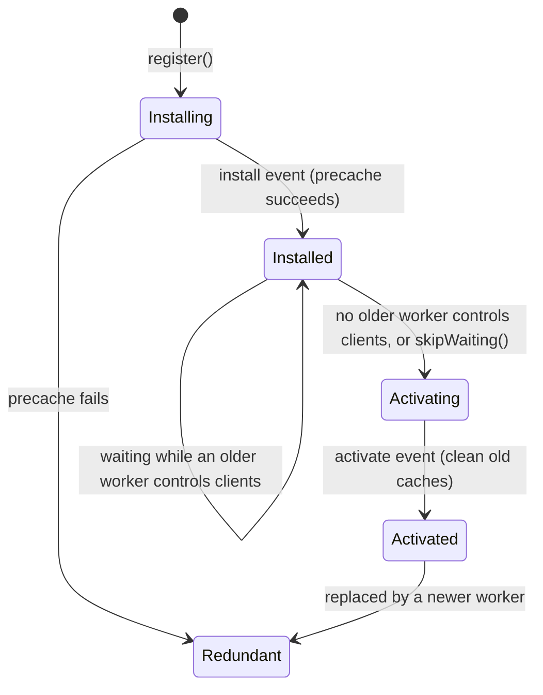

# Review of PWA Technologies and Offline-First Approaches

**Project:** Offline-First Progressive Web Application for Managing Medical Records in Field Conditions

**Thesis point:** 2. Review of PWA technologies and approaches to building offline-first web applications

**Document status:** Draft v0.1

**Related documents:** [`PLAN.md`](../PLAN.md) (Point 2), [`docs/requirements.md`](requirements.md) (requirements referenced below by their identifiers)

---

## Table of contents

1. [Introduction](#1-introduction)
2. [Evaluation criteria](#2-evaluation-criteria)
3. [Progressive Web Application building blocks](#3-progressive-web-application-building-blocks)
4. [Caching strategies](#4-caching-strategies)
5. [Client-side storage](#5-client-side-storage)
6. [IndexedDB libraries](#6-indexeddb-libraries)
7. [Synchronization models](#7-synchronization-models)
8. [Conflict resolution approaches](#8-conflict-resolution-approaches)
9. [Background execution capabilities](#9-background-execution-capabilities)
10. [Service worker tooling for Next.js 16](#10-service-worker-tooling-for-nextjs-16)
11. [Related solutions](#11-related-solutions)
12. [Spikes (experimental validation)](#12-spikes-experimental-validation)
13. [Summary of decisions](#13-summary-of-decisions)
14. [Implications for the requirements and the plan](#14-implications-for-the-requirements-and-the-plan)
15. [References](#15-references)
16. [Revision history](#16-revision-history)

---

## 1. Introduction

### 1.1 Purpose

This document reviews the technologies and architectural approaches available for building offline-first web applications and selects those used in the system. Each selection is justified against the requirements established in `docs/requirements.md`.

### 1.2 Method

The review combines three sources of evidence:

1. **Documentation analysis:** specifications and official documentation (W3C and WHATWG specifications, MDN Web Docs, and the documentation of Next.js 16, Serwist, Dexie.js and related projects).
2. **Literature analysis:** research on local-first software, replicated data types and distributed clocks.
3. **Experimental validation:** small prototypes (spikes) that confirm or refute key assumptions in the project's actual environment (Section 12).

### 1.3 Scope

The technology stack is fixed by constraints TC-01 to TC-05 (Next.js, Serwist, Dexie.js, NestJS, Prisma, PostgreSQL). The review therefore has two aims:

- To position these technologies within the range of alternatives and justify the constraints.
- To choose among the remaining open design options: caching strategies, synchronization model, conflict resolution, background execution, and the Serwist integration mode.

---

## 2. Evaluation criteria

The criteria are derived from the requirements specification.

| ID | Criterion | Derived from |
|---|---|---|
| EV-01 | **Offline capability:** the option supports full operation without network access, including a cold start | NFR-01, NFR-06, FR-30 |
| EV-02 | **Durability:** data written locally survives reloads, crashes and browser restarts, and is protected against eviction | NFR-02, RK-01 |
| EV-03 | **Synchronization support:** the option supports reliable, idempotent and resumable replication with a relational server | FR-05, FR-23, NFR-13 |
| EV-04 | **Conflict handling:** concurrent edits are resolved deterministically, without silent data loss | FR-07, NFR-12, NFR-14 |
| EV-05 | **Platform compatibility:** works on Chromium-based browsers and Safari on iOS/iPadOS, degrading gracefully | TC-06, NFR-16 |
| EV-06 | **Stack fit:** integrates with Next.js 16, NestJS, Prisma and PostgreSQL without extra infrastructure | TC-01 to TC-05 |
| EV-07 | **Developer experience:** TypeScript support, documentation quality, testability | NFR-17, NFR-18 |
| EV-08 | **Maturity and licensing:** active maintenance and an open-source license suitable for academic work | Academic context (requirements, Section 1.3) |

Ratings in the comparison tables use a three-level scale: **High** (fully satisfies the criterion), **Medium** (partially satisfies it or needs extra work), and **Low** (does not satisfy it, or conflicts with it).

---

## 3. Progressive Web Application building blocks

### 3.1 Definition

A Progressive Web Application is a web application that uses modern platform capabilities to offer an experience comparable to native applications: installation to the home screen, offline operation and background execution. It is still delivered over the web from a single code base. Three components are essential:

| Component | Role | Relevance to the system |
|---|---|---|
| **Web App Manifest** | JSON metadata describing the application's name, icons, start URL, display mode and colors | Enables installation (FR-32, NFR-07) |
| **Service worker** | A script run by the browser separately from the page. It intercepts network requests and can respond from a cache | Enables offline start and navigation (FR-30, FR-31) |
| **Secure context (HTTPS)** | Service workers and most related APIs are available only in secure contexts (`localhost` is treated as secure during development) | Deployment requirement (NFR-09) |

### 3.2 Service worker lifecycle

The lifecycle determines how the application is cached and how updates reach users:

Implications for the system:

- **Install.** The application shell and all route shells must be precached in the `install` phase (FR-30). If precaching fails, the new worker is discarded and the previous version remains in control.
- **Waiting.** By default, a new worker waits until all tabs controlled by the old worker are closed. Calling `skipWaiting()` automatically would switch versions while a responder is entering data. The system therefore keeps the new worker waiting and activates it only after the user confirms (FR-33, RK-04).
- **Activate.** Outdated caches are removed during activation.
- **Fetch.** After activation, every request from controlled pages passes through the worker's `fetch` handler, where the caching strategies of Section 4 are applied.

### 3.3 Installability

In Chromium-based browsers, installation is offered when the page is served over HTTPS and provides a valid manifest (with name, icons and start URL). The `beforeinstallprompt` event allows a custom install button. Safari on iOS/iPadOS does not fire this event. Users install through "Add to Home Screen" in the share menu, so the application must show platform-specific instructions (see the Next.js 16 PWA guide, reference [R3]).

Installation also matters for **storage durability** on Safari. Its proactive eviction policy (Section 5.3) does not affect applications saved to the Home Screen in the same way as browser tabs. This is an additional reason to encourage installation (AS-05).

### 3.4 Update flow

Selected update flow:

1. The browser checks for an updated service worker script on navigation. The script is served with `Cache-Control: no-cache` so that updates are detected promptly.
2. A new version installs and enters the waiting state.
3. The page detects the waiting worker and shows an "Update available" banner.
4. On confirmation, the page sends a `SKIP_WAITING` message. The worker activates, and the page reloads.

---

## 4. Caching strategies

### 4.1 Strategy catalogue

| Strategy | Behavior | Strengths | Weaknesses |
|---|---|---|---|
| **CacheOnly** | Responds only from the cache | Fully predictable offline | Never updates |
| **NetworkOnly** | Always uses the network | Always fresh | Fails offline |
| **CacheFirst** | Cache, then network on a miss | Fast, works offline | May serve stale content indefinitely |
| **NetworkFirst** | Network, falling back to the cache on failure or timeout | Fresh when online, works offline | Slow on high-latency links without a timeout |
| **StaleWhileRevalidate** | Responds from the cache immediately and refreshes the cache in the background | Fast and eventually fresh | Serves one stale response after a change |
| **Precache** | Resources listed in a build-time manifest are cached at install time and versioned by revision hash | Guarantees offline availability of the application shell | Only applicable to resources known at build time |

### 4.2 Selected strategies by resource class

| Resource class | Strategy | Justification |
|---|---|---|
| JavaScript and CSS chunks, fonts, icons | Precache | Required for offline cold start (FR-30, NFR-06) |
| Route shells (HTML for each page) | Precache, and **NetworkFirst** with a 3 second timeout for navigations | Offline navigation to any route. The timeout prevents long waits on degraded links (EC-02) |
| Unknown navigations | Fallback to the precached `/~offline` page | FR-31 |
| Images (non-precached) | StaleWhileRevalidate | Non-critical and tolerant of staleness |
| API requests (`/api/*`) | **NetworkOnly** | Record data is never served from the HTTP cache (FR-34). All reads come from IndexedDB, which is the single local source of truth. This avoids two inconsistent local copies of clinical data |

### 4.3 Dynamic routes and offline navigation

A service worker can only precache URLs known at build time. A route such as `/casualties/[id]` has an unbounded set of URLs, and a card created offline has an identifier that did not exist at build time. Two observations follow:

- Next.js 16 can render the shared shell of a parameterized route during a **client-side (soft) navigation** when the shell has been prefetched ([R4]). However, the Next.js documentation states explicitly that a **full page reload while offline fails** unless a service worker provides the HTML.
- A reload, a deep link, or launching the installed application to a card URL is a hard navigation.

The system therefore uses **static routes with query parameters** (for example, `/casualties/card?id=...`). Each such route has one precachable shell that renders any card from IndexedDB. This addresses risk RK-05.

---

## 5. Client-side storage

### 5.1 Storage technologies

| Technology | Data model | Capacity | Transactions | Available in service worker | Suitability |
|---|---|---|---|---|---|
| Cookies | Small string pairs, sent with every request | Very small | No | No | Low: not intended for data storage |
| Web Storage (`localStorage`) | Synchronous string key-value pairs | 5 MiB per origin ([R1]) | No | No | Low: small, synchronous (blocks the main thread), unavailable in workers |
| Cache API | HTTP request and response pairs | Shared origin quota | No | Yes | High for application assets, Low for structured records |
| **IndexedDB** | Transactional object store with indexes | Shared origin quota (Section 5.2) | Yes | Yes | **High: structured records, indexes, transactions, worker access** |
| Origin Private File System (OPFS) | Private file system, with synchronous access in workers | Shared origin quota | No (at the file level) | Yes | Medium: suited to binary files or embedded SQLite (WebAssembly), which adds complexity |

**Decision:** IndexedDB for records, the outbox and metadata. The Cache API, managed by Serwist, for application assets. This confirms constraint TC-02.

### 5.2 Storage quotas

Quotas apply to the whole origin, covering IndexedDB, the Cache API and OPFS together ([R1]):

| Browser | Per-origin quota |
|---|---|
| Chromium-based (Chrome, Edge) | Up to 60% of total disk size, in both best-effort and persistent modes |
| Firefox | Best-effort: the smaller of 10% of disk or 10 GiB (group limit). Persistent: up to 50% of disk |
| Safari (macOS 14 and later, iOS 17 and later) | Around 60% of disk for browser apps. Web apps saved to the Home Screen receive the same quota |

With the estimated footprint of under 20 KB per card (NFR-15), even a restrictive quota of a few hundred megabytes allows for many thousands of cards. Quota exhaustion is therefore not a practical risk. Eviction is.

### 5.3 Eviction and persistence

Browsers store data in **best-effort** mode by default. Best-effort data can be evicted in three situations ([R1]):

1. **Storage pressure:** the device runs low on space. The browser deletes the data of the least recently used origins first.
2. **Browser maximum exceeded:** total browser storage exceeds its overall limit.
3. **Proactive eviction (Safari only):** with cross-site tracking prevention enabled, script-created data of an origin with no user interaction in the last seven days of browser use is deleted.

When eviction occurs, **all** of an origin's data is deleted at once.

Mitigations adopted by the system:

- Call `navigator.storage.persist()` on first launch. Persistent origins are exempt from storage-pressure eviction. Chromium and Safari grant or deny the request automatically based on engagement. Firefox asks the user.
- Show whether persistence was granted, and show `navigator.storage.estimate()` usage in Settings (FR-44).
- Encourage installation to the Home Screen (Section 3.3).
- Synchronize with the server at every opportunity, since the server copy is the ultimate protection against loss (NFR-02).
- Handle `QuotaExceededError` on every write and report it to the user (T-13).

---

## 6. IndexedDB libraries

### 6.1 Motivation

The native IndexedDB API is event-based and verbose, and its transaction lifetime rules are easy to get wrong. A wrapper library is warranted.

### 6.2 Candidates

| Library | Description |
|---|---|
| **Native IndexedDB** | The browser API used directly |
| **idb** | A thin promise-based wrapper over IndexedDB that closely mirrors the native API |
| **Dexie.js** | A full-featured wrapper with a declarative schema, versioned migrations, a query API, and reactive queries (`liveQuery`, and `useLiveQuery` for React) |
| **RxDB** | A reactive NoSQL database built on pluggable storage (including IndexedDB), with a replication protocol and schema validation. Some advanced plugins are commercial |
| **PouchDB** | A JavaScript implementation of the CouchDB data model and replication protocol, storing data in IndexedDB |

### 6.3 Comparison

| Criterion | Native IndexedDB | idb | Dexie.js | RxDB | PouchDB |
|---|---|---|---|---|---|
| API ergonomics | Low | Medium | High | High | Medium |
| TypeScript support | Medium | High | High | High | Medium |
| Declarative schema and versioned migrations | Low (manual `onupgradeneeded`) | Low (manual) | High | High | Low (schemaless) |
| Compound indexes and queries | Medium | Medium | High | High | Medium (Mango queries) |
| Reactive queries for React | Low | Low | High (`useLiveQuery`, including cross-tab updates) | High (RxJS observables) | Medium (changes feed) |
| Multi-table atomic transactions | High | High | High | Medium (document-oriented) | Low (single-document atomicity) |
| Replication with a PostgreSQL/REST back end | Build yourself | Build yourself | Build yourself (optional commercial Dexie Cloud not used) | High (generic HTTP replication protocol) | Low (requires a CouchDB-compatible server) |
| Bundle size | None | Very small | Small to medium | Large | Large |
| Stack fit (EV-06) | High | High | High | Medium | Low |
| Licensing (EV-08) | Not applicable | Open source | Open source (Apache 2.0) | Open-source core, commercial premium plugins | Open source (Apache 2.0) |

### 6.4 Decision

**Dexie.js** is selected, confirming constraint TC-02. The deciding factors are:

1. **Multi-table atomic transactions.** The outbox pattern (Section 7) requires writing the card and its outbox entry in one transaction (FR-20, UT-DB-01). Dexie exposes this directly with `db.transaction("rw", ...)`.
2. **Reactive queries.** `useLiveQuery` updates the casualty list automatically after local writes, synchronization results or changes in another tab (FR-40).
3. **Versioned migrations** support the evolution of the local schema without data loss.
4. **Low coupling.** Dexie imposes no replication protocol. This leaves the synchronization mechanism, a central contribution of the thesis, fully under the project's control and aligned with the relational server model.

RxDB was the strongest alternative. It was rejected because its replication and document model would duplicate the custom synchronization design, and because some relevant features are commercial. PouchDB was rejected because it requires a CouchDB-compatible server, which conflicts with TC-03 and TC-04.

---

## 7. Synchronization models

### 7.1 The local-first perspective

Kleppmann et al. ([R10]) describe *local-first software* as applications in which the primary copy of the data resides on the user's device, the network is used for synchronization and collaboration, and the application remains fully functional offline. The system adopts this model: IndexedDB is the primary data source for the user interface, and the server is a durable replica and synchronization hub.

### 7.2 Candidate models

| Model | Principle | Examples |
|---|---|---|
| **M1. Online-only with request retry** | The server is the only source of truth. Failed requests are retried or queued | Next.js `experimental.useOffline` ([R4]), Workbox/Serwist background sync queues |
| **M2. Custom outbox with push/pull REST protocol** | Local database plus a queue of pending mutations. The server applies mutations idempotently. Clients pull changes by cursor | Custom implementation (selected) |
| **M3. Document database replication** | Multi-master replication with revision trees | PouchDB with CouchDB |
| **M4. CRDT-based replication** | Data types whose concurrent updates always merge deterministically | Yjs, Automerge ([R8], [R9]) |
| **M5. Managed PostgreSQL sync engines** | A third-party service streams PostgreSQL changes to client-side databases and accepts writes | Commercial and open-source sync engines (for example, ElectricSQL and PowerSync) |

### 7.3 Comparison

| Criterion | M1 Online + retry | M2 Custom outbox | M3 CouchDB | M4 CRDT | M5 Managed engine |
|---|---|---|---|---|---|
| EV-01 Offline reads and writes | Low (no local data model) | High | High | High | High |
| EV-03 Reliable, idempotent sync | Medium | High (by design) | High | High | High |
| EV-04 Deterministic conflicts without silent loss | Low | High (field-level merge with conflict log) | Medium (a winning revision is chosen; losers are kept but require application logic) | High (automatic merge) | Medium (depends on engine) |
| EV-06 Fit with NestJS, Prisma, PostgreSQL | High | High | Low (CouchDB server) | Medium (CRDT documents are opaque binary data to a relational schema) | Medium (extra infrastructure and vendor dependency) |
| Server-side validation of clinical values (NFR-09) | High | High | Low | Low (merge happens before validation) | Medium |
| Transparency for academic analysis | Low | High | Medium | Medium | Low |

### 7.4 Discussion

- **M1** is insufficient. The Next.js 16 `useOffline` feature keeps failed navigations and Server Actions pending and retries them when the network returns. The Next.js documentation notes that it does not make a full reload work offline, and it gives no local data model. Pending requests are also lost if the page is closed. This fails NFR-01 and NFR-02.
- **M3** replicates well but requires CouchDB instead of PostgreSQL and NestJS.
- **M4** CRDTs guarantee convergence and are excellent for collaborative text editing. For structured clinical records, however, they add metadata overhead and make it hard to validate values on the server before they are merged. The medical domain also benefits from explicit review of conflicting clinical values (FR-27), which a fully automatic merge obscures.
- **M5** would reduce implementation effort but adds infrastructure beyond TC-03 and TC-04. It would also move the core research contribution into a third-party component.

### 7.5 Decision

**M2, a custom outbox with a push/pull REST protocol**, is selected. The design is specified in `PLAN.md` Point 4 and summarized here:

- Every local write updates the aggregate and appends a mutation to the outbox in one IndexedDB transaction.
- The server applies each mutation exactly once, using the mutation identifier as an idempotency key (FR-23).
- Clients pull changed aggregates using a monotonic server sequence number as a cursor.
- Conflicts are resolved as described in Section 8.

---

## 8. Conflict resolution approaches

### 8.1 The problem

Two devices can modify the same card while disconnected from each other (UC-06, alternative flow 3a). When both synchronize, the system must decide which value prevails. The decision must be deterministic, so that all replicas converge (NFR-12). It must not silently discard clinical information (FR-07).

### 8.2 Candidate approaches

| Approach | Description | Advantages | Disadvantages |
|---|---|---|---|
| **Record-level last-writer-wins (LWW)** | The most recent version of the whole record replaces the other | Simple | Loses non-conflicting edits to different fields |
| **Field-level LWW** | Each field carries its own time stamp, and the latest value per field wins | Preserves concurrent edits to different fields | Still discards one value when the same field is edited concurrently |
| **Optimistic concurrency with rejection** | A write is rejected if the record changed since it was read (version check) | No silent loss | Unsuitable offline: rejected writes after long disconnection are frustrating and risk data loss |
| **Manual merge** | The user resolves every conflict | Full control | Burdens users under stress. Does not scale |
| **CRDTs** | Types with mathematically guaranteed merge semantics ([R7]) | Automatic convergence | See Section 7.4 |

### 8.3 Ordering events: clocks

LWW needs a way to decide which write is "later":

| Clock | Description | Suitability |
|---|---|---|
| Device wall-clock time | Time stamp from the device's system clock | Low: device clocks may be wrong (EC-07) |
| Server receive time | Time stamp assigned when the server receives the change | Low: after offline periods, it reflects synchronization order, not edit order |
| Lamport clock | A logical counter incremented on each event and advanced on receipt | Medium: consistent ordering, but unrelated to real time |
| Vector clock | One counter per replica | Medium: detects true concurrency, but its size grows with the number of devices |
| **Hybrid Logical Clock (HLC)** ([R6]) | Combines physical time with a logical counter. It stays close to real time, is monotonic, and preserves causality even when clocks drift | **High** |

### 8.4 Decision

The system combines the following:

1. **Field-level LWW for card fields**, ordered by an HLC time stamp stored per field (`fieldClock`).
2. **Row-level LWW for child records** (vital signs, medications, fluids, injury sites, tourniquets), with deletions represented as tombstones. Most child records are only appended, so true conflicts are rare.
3. **A conflict log.** Every value that loses a comparison is stored in `SyncConflict`, so no value is silently lost (FR-07).
4. **Mandatory review of critical fields.** Conflicts on evacuation priority, allergies and tourniquet data are flagged for explicit user review (FR-27).
5. **Deterministic identifiers for natural keys.** A tourniquet's identifier is derived from the card identifier and the limb, so concurrent entries for the same limb merge instead of duplicating.
6. **Clock correction.** The HLC is advanced using the server time returned by every response, which limits the effect of device clock skew (NFR-14).

---

## 9. Background execution capabilities

### 9.1 APIs

| API | Purpose | Support |
|---|---|---|
| **Background Sync API** (`SyncManager`) | Defers work until the device has connectivity, even if the page has been closed | Chromium-based browsers only. Not supported in Safari or Firefox |
| **Periodic Background Sync API** | Periodic background work for installed applications | Chromium-based browsers only, for installed applications, at a frequency determined by the browser based on engagement |
| **Background Fetch API** | Large downloads that continue after the page closes | Chromium-based browsers only. Not needed by the system |
| **Web Locks API** | Coordinates exclusive access to a resource across tabs and workers | All target browsers |
| **BroadcastChannel API** | Messaging between tabs and workers of the same origin | All target browsers |

### 9.2 Implications

Background Sync cannot be the primary synchronization trigger because it is unavailable on Safari (TC-06, DP-02). The system therefore uses a **layered trigger strategy**:

| Trigger | Platforms | Purpose |
|---|---|---|
| Local write (debounced) | All | Send changes as soon as possible |
| `online` event | All | React to the network interface coming back |
| `visibilitychange` (page becomes visible) | All | Synchronize when the user returns to the application |
| Periodic timer while the page is open | All | Recover from missed events |
| Manual "Sync now" | All | User control (FR-28) |
| Background Sync `sync` event | Chromium only | Synchronize after the application is closed (FR-29) |

The `online` event and `navigator.onLine` only report the state of the network interface. They cannot tell a working uplink from a connected network with no route to the server. Actual connectivity is therefore confirmed with a health check request that has a timeout (FR-26). The Next.js documentation makes the same point about `navigator.onLine` ([R4]).

The **Web Locks API** ensures that only one tab synchronizes at a time, which prevents duplicate pushes from multiple open tabs.

---

## 10. Service worker tooling for Next.js 16

### 10.1 Options

| Option | Description |
|---|---|
| Hand-written service worker | A plain script using the Cache API directly |
| Workbox | Google's libraries for service worker caching and precache manifest generation |
| **Serwist** | A maintained fork and evolution of Workbox, with first-class Next.js integrations. Next.js 16's PWA guide points to it for offline caching ([R3]) |
| `next-pwa` and derivatives | Older Next.js plugins built on Workbox and webpack |

A hand-written service worker requires reimplementing precache manifest generation, cache versioning and strategy handling, which is error-prone. `next-pwa` depends on webpack-era internals. Workbox has no maintained integration with the Next.js App Router. **Serwist** is selected, confirming constraint TC-01.

### 10.2 Integration modes

Next.js 16 uses **Turbopack** as the default bundler. Serwist offers three integration modes ([R5]):

| Mode | Package | How it works | Bundler |
|---|---|---|---|
| webpack plugin | `@serwist/next` | Compiles the worker and injects the precache manifest during the webpack build | Requires `next build --webpack` |
| **Turbopack** | `@serwist/turbopack` | A `withSerwist()` configuration wrapper plus a route handler (`app/serwist/[path]/route.ts`) that compiles the worker with esbuild. The client registers it through `SerwistProvider` | Works with the default Turbopack build |
| Configurator mode | `@serwist/cli` | Generates the worker as a separate build step after `next build` | Independent of the bundler |

### 10.3 Assessment

| Criterion | webpack plugin | Turbopack | Configurator |
|---|---|---|---|
| Works with the Next.js 16 default build | Low (webpack must be forced) | High | High |
| Build speed | Medium | High | High |
| Integration effort | Low | Low | Medium (separate build step) |
| Officially referenced by Next.js 16 documentation | Yes | Yes | No |

### 10.4 Decision

The **Turbopack integration (`@serwist/turbopack`)** is used. It keeps the project on the Next.js 16 default toolchain and avoids forcing a webpack build. Spike A (Section 12.1) confirmed this in the current client: `withSerwist()` in `next.config.ts`, the worker compiled from `src/app/sw.ts`, and registration at scope `/`. `@serwist/next` with `next build --webpack` remains the fallback if precaching or scope fails.

---

## 11. Related solutions

The table compares categories of existing solutions for casualty documentation with the proposed system.

| Category | Examples | Offline | Multi-device sync | Platform independence | Distribution | Limitations relative to the requirements |
|---|---|---|---|---|---|---|
| Paper card | DD Form 1380 | Yes | No | Not applicable | Physical | Problems P-01 to P-06 (`docs/requirements.md`, Section 2.3) |
| Native military casualty documentation applications | For example, the Battlefield Assisted Trauma Distributed Observation Kit (BATDOK) developed for the U.S. Air Force | Yes | Varies | Low (tied to specific devices or operating systems) | Controlled or institutional channels | Platform-specific. Not openly available for research |
| National electronic primary medical records for military casualties | For example, electronic versions of national primary medical cards integrated into national e-health systems | Varies (often online-dependent) | Server-centric | Medium | Institutional | Typically require connectivity to a central system at the time of entry |
| General-purpose offline data collection tools | ODK Collect, KoboToolbox ([R11]) | Yes | Upload-oriented (one-way submission) | Medium (primarily Android) | App stores | Designed for survey submission rather than collaborative editing of a live record. No merging of concurrent edits |
| **Proposed system** | TCCC PWA | Yes | Yes (two-way with conflict resolution) | High (any modern browser) | Web, installable without an app store | Subject to browser platform limits (Sections 5.3 and 9) |

The proposed system is positioned as an open, standards-based alternative. It combines offline operation, two-way multi-device synchronization with explicit conflict handling, and platform-independent distribution.

Note: descriptions of institutional and military systems are based on publicly available information and must be verified against primary sources before the thesis is submitted.

---

## 12. Spikes (experimental validation)

Each spike is a short, time-boxed prototype that validates one assumption in the project's actual environment (Next.js 16.3, Serwist 9.5, Dexie 4.4, on Windows and Chromium/WebKit). The results are recorded here and feed into the final decisions.

### 12.1 Spike A: Serwist integration with Next.js 16

| Attribute | Description |
|---|---|
| Objective | Confirm the Serwist integration mode (Section 10.4) |
| Hypothesis | `@serwist/turbopack` works with the default Next.js 16 build and provides full offline start |
| Procedure | 1. Read `apps/client/node_modules/next/dist/docs/` (PWA and offline guides), as required by `apps/client/AGENTS.md`. 2. Install `@serwist/turbopack` and `esbuild`. Wrap `next.config.ts` with `withSerwist()`. 3. Add `app/serwist/[path]/route.ts` and a minimal `app/sw.ts`. 4. Register the worker with `SerwistProvider` in the root layout. 5. Run `next build && next start`. 6. In Chrome DevTools, check the Application panel: registration, scope and precache contents |
| Acceptance criteria | Build succeeds. Worker scope is `/`. All route shells are listed in the precache |
| Fallback | `@serwist/next` with `next build --webpack` |
| Result | Completed. `next.config.ts` wraps the config with `withSerwist()` from `@serwist/turbopack`. The worker in `src/app/sw.ts` is served at `/serwist/sw.js`, and the root layout registers it with `SerwistProvider` at scope `/`, so the default Next.js build is used instead of `next build --webpack`. |
| Status | Completed |

### 12.2 Spike B: Precache and offline fallback

| Attribute | Description |
|---|---|
| Objective | Validate offline cold start and the offline fallback page (FR-30, FR-31, NFR-06) |
| Procedure | 1. Using the Spike A setup, add a `/~offline` page and a second static route. 2. Visit the application once while online. 3. Enable offline mode in DevTools and reload. 4. Navigate to a known route and to an unknown URL. 5. Record the time to first render using the Performance panel |
| Acceptance criteria | The application shell renders offline after a reload. Unknown navigations show `/~offline`. First render takes under 2 seconds |
| Result | Completed. Navigations use NetworkFirst with a 3 second timeout, then the precached route shell, then `/~offline`. `app/serwist/[path]/route.ts` precaches the static shells, including `/`, the card routes, `/sync`, `/settings`, and `/~offline`. |
| Status | Completed |

### 12.3 Spike C: Dexie reactivity and transactions

| Attribute | Description |
|---|---|
| Objective | Validate reactive queries across tabs (FR-40) and atomic multi-table writes (FR-20) |
| Procedure | 1. Create a Dexie database with `casualties` and `outbox` tables. 2. Render a list with `useLiveQuery`. 3. Write a record from a second tab and observe the first tab. 4. Write a card and an outbox entry in one transaction, and throw an error inside the transaction to confirm the rollback |
| Acceptance criteria | The first tab updates without a reload. An aborted transaction leaves neither record |
| Result | Completed. `CasualtyList` reads IndexedDB through `useLiveQuery`, which refreshes when another tab writes. `casualtyRepo` stores the card and its outbox entry in one Dexie transaction, and the repository test shows that a failure inside that transaction leaves neither record. |
| Status | Completed |

### 12.4 Spike D: Installability and audit

| Attribute | Description |
|---|---|
| Objective | Validate installability (FR-32, NFR-07) and establish a baseline Lighthouse score |
| Procedure | 1. Add `app/manifest.ts` with name, short name, `display: "standalone"`, start URL, theme and background colors, and 192 px, 512 px and maskable icons. 2. Run Lighthouse against `next start`. 3. Install on a Chromium desktop browser and, if available, on an iOS device through "Add to Home Screen". 4. Call `navigator.storage.persist()` in the installed application and record the result |
| Acceptance criteria | Installability checks pass. The installed application starts offline. The persistence result is recorded per platform |
| Result | Completed. `src/app/manifest.ts` declares a standalone app with theme color `#0a0a0a` and the 192 px, 512 px, and maskable icons in `public/icons`. Settings requests persistent storage and shows usage and quota from `navigator.storage.estimate()`. |
| Status | Completed |

---

## 13. Summary of decisions

| ID | Topic | Decision | Main alternatives rejected | Requirements addressed |
|---|---|---|---|---|
| D-01 | Application model | Installable PWA | Native mobile applications | TC-01, TC-06, FR-32 |
| D-02 | Asset caching | Serwist precache for the application shell and route shells. NetworkFirst with timeout for navigations. `/~offline` fallback | Runtime-only caching | FR-30, FR-31, NFR-06 |
| D-03 | API caching | NetworkOnly for `/api/*`. Data served only from IndexedDB | Caching API responses | FR-34 |
| D-04 | Routing for offline records | Static routes with query parameters | Dynamic `[id]` segments | RK-05 |
| D-05 | Local storage | IndexedDB | Web Storage, OPFS with SQLite | TC-02, FR-20 |
| D-06 | IndexedDB library | Dexie.js | idb, RxDB, PouchDB | FR-20, FR-40, NFR-17 |
| D-07 | Durability | `navigator.storage.persist()`, storage monitoring, early synchronization | Relying on best-effort storage | NFR-02, RK-01, FR-44 |
| D-08 | Synchronization model | Custom outbox with idempotent push and cursor-based pull | Online-only with retry, CouchDB replication, CRDTs, managed sync engines | FR-05, FR-23, NFR-13 |
| D-09 | Conflict resolution | Field-level LWW for card fields, row-level LWW with tombstones for child rows, conflict log, review of critical fields | Record-level LWW, rejection, full manual merge | FR-07, FR-27, NFR-12 |
| D-10 | Event ordering | Hybrid Logical Clock with server time correction | Wall-clock time, vector clocks | NFR-14, EC-07 |
| D-11 | Background synchronization | Layered triggers, with Background Sync as an enhancement on Chromium | Background Sync as the only trigger | FR-25, FR-26, FR-29, DP-02 |
| D-12 | Connectivity detection | Health check with timeout | `navigator.onLine`, Next.js `useOffline` | FR-26 |
| D-13 | Service worker tooling | Serwist, Turbopack mode (`@serwist/turbopack`) | Hand-written worker, Workbox, `next-pwa`, Serwist webpack mode (kept as fallback) | TC-01, DP-01 |
| D-14 | Cross-tab coordination | Web Locks API for single-flight synchronization | Leader election through localStorage | NFR-02 |

---

## 14. Implications for the requirements and the plan

1. **Dependency change (D-13).** Spike A confirmed the Turbopack mode. `apps/client` depends on `@serwist/turbopack` and `esbuild`, compiles `src/app/sw.ts` through `app/serwist/[path]/route.ts`, and registers the worker with `SerwistProvider`.
2. **Dependency DP-01** (`docs/requirements.md`, Section 12.2) is resolved by that same integration: the service worker is part of the default Next.js 16 build.
3. **Installation guidance.** Because Safari has no install prompt and applies proactive eviction to non-installed sites, the application should show "Add to Home Screen" instructions on iOS. This refines FR-32 and supports AS-05.
4. **Next.js `useOffline` (D-12).** The experimental hook is not used for data synchronization. It may optionally be used for a connectivity indicator in the user interface, but the health check (FR-26) remains authoritative.
5. **Service worker headers.** The service worker script must be served with `Cache-Control: no-cache` so that updates are detected promptly (Section 3.4). This is verified as part of Spike A.

---

## 15. References

| ID | Reference |
|---|---|
| R1 | MDN Web Docs. *Storage quotas and eviction criteria.* https://developer.mozilla.org/en-US/docs/Web/API/Storage_API/Storage_quotas_and_eviction_criteria |
| R2 | MDN Web Docs. *Service Worker API.* https://developer.mozilla.org/en-US/docs/Web/API/Service_Worker_API |
| R3 | Next.js documentation (v16). *How to build a Progressive Web Application (PWA) with Next.js.* Bundled at `apps/client/node_modules/next/dist/docs/01-app/02-guides/progressive-web-apps.md` |
| R4 | Next.js documentation (v16). *Handling connectivity drops (Offline support).* Bundled at `apps/client/node_modules/next/dist/docs/01-app/02-guides/offline-support.md` |
| R5 | Serwist documentation. *@serwist/next: Turbopack.* https://serwist.pages.dev/docs/next/turbo |
| R6 | Kulkarni, S., Demirbas, M., Madappa, D., Avva, B., Leone, M. (2014). *Logical Physical Clocks and Consistent Snapshots in Globally Distributed Databases.* Proceedings of OPODIS 2014 |
| R7 | Shapiro, M., Preguica, N., Baquero, C., Zawirski, M. (2011). *Conflict-free Replicated Data Types.* Proceedings of SSS 2011 |
| R8 | Yjs documentation. https://docs.yjs.dev |
| R9 | Automerge documentation. https://automerge.org |
| R10 | Kleppmann, M., Wiggins, A., van Hardenberg, P., McGranaghan, M. (2019). *Local-first software: You own your data, in spite of the cloud.* Proceedings of Onward! 2019 |
| R11 | ODK documentation. https://getodk.org |
| R12 | Dexie.js documentation. https://dexie.org |
| R13 | MDN Web Docs. *Background Synchronization API.* https://developer.mozilla.org/en-US/docs/Web/API/Background_Synchronization_API |
| R14 | MDN Web Docs. *Web Locks API.* https://developer.mozilla.org/en-US/docs/Web/API/Web_Locks_API |

---

## 16. Revision history

| Version | Date | Author | Description |
|---|---|---|---|
| 0.1 | 2026-09-23 | Vladyslav | Initial draft: technology review, comparisons, decisions D-01 to D-14, spike protocols |
| 0.2 | 2026-09-29 | Vladyslav | Recorded outcomes for Spikes A to D from the current client implementation |
